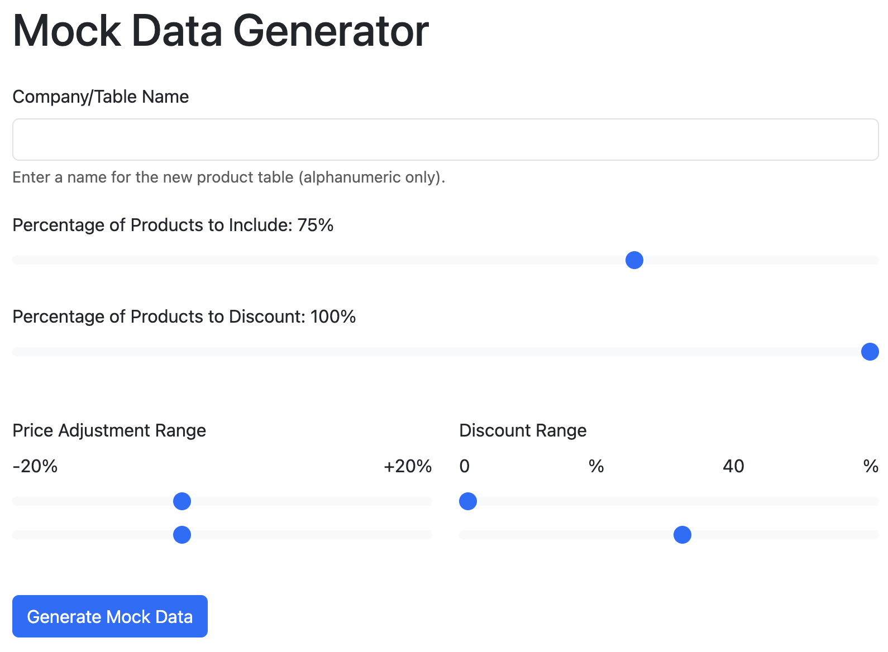

# CompareIt

CompareIt is a next-generation price comparison web application aggregating product listings from various online retailers. Our platform provides a clean, user-friendly experience for users to browse products, compare prices across different retailers, leave reviews, and find the best deals. We also offer filtering by criteria like price and brand, and managing user accounts with secure authentication. Combining real-world data with mock pricing, CompareIt delivers a realistic shopping experience, emphasizing performance, security, and usability.

## 418 Teapots Group Members

-   Damian Moustakis (u24564738)
-   Aaron Kim (u21494305)
-   Michael Tomlinson (u24569705)
-   Ayrtonn Taljaard (u24856462)
-   Dawid Eales (u24608892)
-   Wilmar Smit (u24584216)

## Table of Contents

-   [Market Research (Task 1)](#market-research-task-1)
-   [Mock Data Generation (Task 6)](#mock-data-generation-task-6)
-   [Development Guidelines (Task 8 & 10)](#development-guidelines-task-8--10)
-   [Demo Details (Task 9)](#demo-details-task-9)
-   [Database Design](#database-design)
    -   [Structure (Task 2)](#structure-task-2)
    -   [Relational Mapping (Task 3)](#relational-mapping-task-3)
    -   [Relational Constraints (Task 4)](#relational-constraints-task-4)
    -   [Optimisation (Task 7)](#optimisation-task-7)
-   [Website Functionality (Task 5)](#website-functionality-task-5)
    -   [API](#api)
    -   [Backend JS](#backend-js)
    -   [Frontend](#frontend)
-   [Individual Contributions](#individual-contributions)
    -   [Damian Moustakis (u24564738)](#damian-moustakis-u24564738)
    -   [Aaron Kim (u21494305)](#aaron-kim-u21494305)
    -   [Michael Tomlinson (u24569705)](#michael-tomlinson-u24569705)
    -   [Ayrtonn Taljaard (u24856462)](#ayrtonn-taljaard-u24856462)
    -   [Dawid Eales (u24608892)](#dawid-eales-u24608892)
    -   [Wilmar Smit (u24584216)](#wilmar-smit-u24584216)

## Market Research (Task 1)
### Competing Products
**Analyzed Competitors:**

- **PriceCheck**, **Smartprice**, **GoogleShopping** - Wide product range but poor user experience, confusing navigation
- **Troli** - Best UX focused on groceries only, clear onboarding process

**Key Gaps Identified:**

- Lack of technology product focus in South Africa
- Poor user guidance and functionality explanation
- No gamified or interactive design elements

**CompareIt Solution:**

- Technology-focused scope (laptops, desktops, components, consoles)
- Clean, gamified design with interactive elements
- Improved user experience addressing SA tech market markup issues

### Data Sources

- **Given API** choices - these didn't have good quality/enough data
- **Web scrapers** - questionable legality - hard to implement
- **eBay Developer API** - lots of variety between products - how do you easily compare iPhone to iPhone - without accidentally comparing an iPhone Case
- **Amazon Affiliate Program API** - unable to apply for Affiliate Program in South Africa
- **Best Buy Developer API** - Our Choice - Good Documentation - Able to get API key - easy to use query builder - lots of tech products - we decided to use this as a parent products dataset
## Mock Data Generation (Task 6)

### JSON Extraction
We tested the Best Buy API and choose several categories to give us a good spread of products:
- Appliances
- Audio Headphones
- Cameras
- Car Electronics
- Cell Phones
- Computers
- TV Home Theater

**[Best Buy API Data Extractor](MockDataTools/MockdataLoader/fetch_bestbuy.py)**

### Extracting Products from JSON
- Used PHP to insert products into a Best Products Table
- **[JSON to Database Product Extractor](MockDataTools/MockdataLoader)**

### Mock Data Generator & Generation
**[Mock Data Generator](MockDataTools/MockDataGenerationTool)**



### Price Calculation
Searched all the mock companies and find who offers the best price
Update the best products table

**[Price Calculator](MockDataTools/PriceCalculation)**

## Development Guidelines (Task 8 & 10)

### Git Workflow & Commits

- **Commit frequently** 
    - Commit when you complete a function/class, not at end of day
- **Detailed commit messages**
    - Other team members need to understand what you've implemented
- **Branch strategy**
    - Separate branches for each website section
- **Pull requests**
    - Testing and review process before merging to main branch
- **Only working code**
    - Ensure functionality works before committing to main

### Code Standards

- **Comment your code**
    - For teammate understanding and demo purposes
-  **Clear documentation**
    - All API requests and functionality should be documented in README
-  **Keep README current**
    - Should serve as living documentation for the project

## Demo Details (Task 9)
Need to clarify how this is going to work - basically explain where to find dump etc. and how to boot using a local server or how to access the wheatley

## Database Design

### Structure (Task 2)

### Relational Mapping (Task 3)

### Relational Constraints (Task 4)

### Optimisation (Task 7)

## Website Functionality (Task 5)

### API

#### API Design

The API follows RESTful principles using POST requests with JSON payloads. All communication occurs through a single endpoint that routes requests based on the `type` parameter in the request body.

##### RESTful Principles

- **Stateless**: Each request contains all necessary information for processing
- **Uniform Interface**: Consistent request/response structure across all endpoints
- **Resource-Based**: Operations are performed on clearly defined resources (users, products, reviews)

##### Request and Response Formats

###### Request Format
All requests are sent as POST with stringified JSON in the request body:

```json
{
  "type": "endpoint_name",
  "api_key": "your_api_key_here",
  "parameter1": "value1",
  "parameter2": "value2"
}
```

###### Response Format
All responses follow a consistent structure:

```json
{
  "status": "success|error",
  "timestamp": 1640995200,
  "data": {},
  "message": "Descriptive message"
}
```

**Response Fields:**
- `status`: Indicates success or failure of the request
- `timestamp`: Unix timestamp for debugging and logging purposes
- `data`: Contains the requested information (empty object on error)
- `message`: Human-readable description for debugging and user feedback

#### Security

- **API Key Authentication**: All endpoints (except login/register) require valid API keys
- **Password Security**: Passwords are hashed using SHA-512 with random salts
- **Database Security**: Database credentials are stored in a private configuration file ([connection.php](link-to-connection-file))
- **Input Validation**: All user inputs are validated and sanitized before database operations

#### Endpoints

##### User Management

###### Login
Authenticates user credentials and returns an API key for subsequent requests.

**Request:**
```json
{
  "type": "login",
  "username": "johndoe",
  "password": "SecurePass123!"
}
```

**Response:**
```json
{
  "status": "success",
  "timestamp": 1640995200,
  "data": {
    "api_key": "abc123def456...",
    "user_id": 1,
    "username": "johndoe",
    "is_admin": false
  },
  "message": "Login successful"
}
```

###### Register
Creates a new user account and returns an API key.

**Request:**
```json
{
  "type": "register",
  "username": "newuser",
  "password": "SecurePass123!",
  "email": "user@example.com"
}
```

**Response:**
```json
{
  "status": "success",
  "timestamp": 1640995200,
  "data": {
    "api_key": "xyz789abc123..."
  },
  "message": "Registration successful"
}
```

###### Admin Login
Authenticates admin users and generates a new API key for admin operations.

**Request:**
```json
{
  "type": "adminlogin",
  "username": "admin",
  "password": "AdminPass123!"
}
```

**Response:**
```json
{
  "status": "success",
  "timestamp": 1640995200,
  "data": {
    "username": "admin",
    "api_key": "admin123key456...",
    "is_admin": true
  },
  "message": "Admin login successful"
}
```

##### Product Management

###### Get Product Page
Retrieves a paginated list of products with filtering and sorting options.

**Request:**
```json
{
  "type": "getproductpage",
  "api_key": "your_api_key",
  "limit": 51,
  "offset": 0,
  "sort": "price-low",
  "in_stock_only": true,
  "search": "laptop",
  "brands": ["Dell", "HP"],
  "categories": ["Laptops"],
  "min_price": 100.00,
  "max_price": 1000.00
}
```

**Response:**
```json
{
  "status": "success",
  "timestamp": 1640995200,
  "data": [
    {
      "id": 1,
      "name": "Dell Laptop XPS 13",
      "brand": "Dell",
      "category": "Laptops",
      "thumbnail": "https://example.com/image.jpg",
      "reviewAverage": "4.50",
      "reviewCount": 25,
      "regularPrice": "1299.99",
      "salePrice": "999.99",
      "discountPercent": 23,
      "inStock": true,
      "bestCompany": "TechNova",
      "description": "High-performance ultrabook..."
    }
  ],
  "pagination": {
    "total": 150,
    "offset": 0,
    "limit": 51,
    "has_more": true
  },
  "message": "Product details retrieved successfully"
}
```

###### Get Product
Retrieves detailed information for a specific product including price comparisons.

**Request:**
```json
{
  "type": "getproduct",
  "api_key": "your_api_key",
  "product_id": 1
}
```

**Response:**
```json
{
  "status": "success",
  "timestamp": 1640995200,
  "data": {
    "product": {
      "ProductID": 1,
      "Name": "Dell Laptop XPS 13",
      "Description": "High-performance ultrabook...",
      "ThumbnailImage": "https://example.com/thumb.jpg",
      "ReviewAverage": "4.50",
      "ReviewCount": 25,
      "CarouselImages": "https://example.com/img1.jpg,https://example.com/img2.jpg",
      "SalePrice": "999.99",
      "OnlineAvailability": 1,
      "Type": "HardGood",
      "BrandName": "Dell",
      "CategoryName": "Laptops"
    },
    "price_comparisons": {
      "TechNova": {
        "regularPrice": "1299.99",
        "discountedPrice": "999.99",
        "discountPercentage": 23.09
      },
      "ByteMart": {
        "regularPrice": "1299.99",
        "discountedPrice": "1099.99",
        "discountPercentage": 15.38
      }
    }
  },
  "message": "Product details retrieved successfully"
}
```

##### Review Management

###### Add Review
Creates a new product review for the authenticated user.

**Request:**
```json
{
  "type": "addreview",
  "api_key": "your_api_key",
  "product_id": 1,
  "rating": 5,
  "review_title": "Excellent laptop!",
  "review_description": "Great performance and build quality. Highly recommended."
}
```

**Response:**
```json
{
  "status": "success",
  "timestamp": 1640995200,
  "data": {},
  "message": "Review added successfully"
}
```

###### Get Reviews
Retrieves all reviews for a specific product.

**Request:**
```json
{
  "type": "getreviews",
  "api_key": "your_api_key",
  "product_id": 1
}
```

**Response:**
```json
{
  "status": "success",
  "timestamp": 1640995200,
  "data": [
    {
      "review_id": 1,
      "user_id": 2,
      "username": "reviewer123",
      "rating": 5,
      "title": "Excellent laptop!",
      "description": "Great performance and build quality.",
      "timestamp": "2024-01-15 10:30:00"
    }
  ],
  "message": ""
}
```

###### Edit Review
Updates an existing review by the authenticated user.

**Request:**
```json
{
  "type": "editreview",
  "api_key": "your_api_key",
  "review_id": 1,
  "rating": 4,
  "review_title": "Good laptop",
  "review_description": "Updated review content..."
}
```

**Response:**
```json
{
  "status": "success",
  "timestamp": 1640995200,
  "data": {},
  "message": "Review updated successfully"
}
```

###### Remove Review
Deletes a review by the authenticated user.

**Request:**
```json
{
  "type": "removereview",
  "api_key": "your_api_key",
  "review_id": 1
}
```

**Response:**
```json
{
  "status": "success",
  "timestamp": 1640995200,
  "data": {},
  "message": "Review deleted successfully"
}
```

##### Filter Data

#### Get Categories
Retrieves all available product categories.

**Request:**
```json
{
  "type": "getcategories",
  "api_key": "your_api_key"
}
```

**Response:**
```json
{
  "status": "success",
  "timestamp": 1640995200,
  "data": [
    {
      "category_id": 1,
      "category_name": "Laptops"
    },
    {
      "category_id": 2,
      "category_name": "Desktops"
    }
  ],
  "message": ""
}
```

###### Get Brands
Retrieves all available product brands.

**Request:**
```json
{
  "type": "getbrands",
  "api_key": "your_api_key"
}
```

**Response:**
```json
{
  "status": "success",
  "timestamp": 1640995200,
  "data": [
    {
      "brand_id": 1,
      "brand_name": "Dell"
    },
    {
      "brand_id": 2,
      "brand_name": "HP"
    }
  ],
  "message": ""
}
```

###### Get Companies
Retrieves all available retailer companies.

**Request:**
```json
{
  "type": "getcompanies",
  "api_key": "your_api_key"
}
```

**Response:**
```json
{
  "status": "success",
  "timestamp": 1640995200,
  "data": [
    {
      "company_id": 1,
      "company_name": "TechNova"
    },
    {
      "company_id": 2,
      "company_name": "ByteMart"
    }
  ],
  "message": ""
}
```

##### Admin Management

*Note: The following endpoints require admin privileges.*

###### Get Admin Products
Retrieves products for admin management, optionally filtered by company.

**Request:**
```json
{
  "type": "getadminproducts",
  "api_key": "admin_api_key",
  "company": "TechNova"
}
```

**Response:**
```json
{
  "status": "success",
  "timestamp": 1640995200,
  "data": [
    {
      "ProductID": 1,
      "Name": "Dell Laptop XPS 13",
      "Description": "High-performance ultrabook...",
      "BrandName": "Dell",
      "CategoryName": "Laptops",
      "RegularPrice": "1299.99",
      "BestPrice": "999.99",
      "OnlineAvailability": true,
      "ThumbnailImage": "https://example.com/thumb.jpg",
      "CarouselImages": "https://example.com/img1.jpg,https://example.com/img2.jpg"
    }
  ],
  "message": ""
}
```

###### Add Product
Creates a new product in the system.

**Request:**
```json
{
  "type": "addproduct",
  "api_key": "admin_api_key",
  "name": "New Laptop Model",
  "description": "Latest laptop with advanced features",
  "brand_id": 1,
  "category_id": 1,
  "regular_price": 1499.99,
  "discount_price": 1299.99,
  "thumbnail_image": "https://example.com/new-thumb.jpg",
  "online_availability": 1,
  "company": "TechNova"
}
```

**Response:**
```json
{
  "status": "success",
  "timestamp": 1640995200,
  "data": {
    "product_id": 123
  },
  "message": "Product added successfully"
}
```

###### Update Product
Updates an existing product's information.

**Request:**
```json
{
  "type": "updateproduct",
  "api_key": "admin_api_key",
  "product_id": 1,
  "name": "Updated Product Name",
  "description": "Updated description",
  "regular_price": 1599.99,
  "best_price": 1399.99,
  "company": "TechNova"
}
```

**Response:**
```json
{
  "status": "success",
  "timestamp": 1640995200,
  "data": {},
  "message": "Product updated successfully"
}
```

###### Delete Product
Removes a product from the system.

**Request:**
```json
{
  "type": "deleteproduct",
  "api_key": "admin_api_key",
  "product_id": 1
}
```

**Response:**
```json
{
  "status": "success",
  "timestamp": 1640995200,
  "data": {},
  "message": "Product deleted successfully"
}
```

###### Get All Users
Retrieves a list of all users in the system.

**Request:**
```json
{
  "type": "getallusers",
  "api_key": "admin_api_key"
}
```

**Response:**
```json
{
  "status": "success",
  "timestamp": 1640995200,
  "data": [
    {
      "id": 1,
      "username": "johndoe",
      "email": "john@example.com",
      "created_at": "2024-01-15 10:30:00",
      "is_admin": false
    }
  ],
  "message": ""
}
```

###### Add User
Creates a new user account (admin function).

**Request:**
```json
{
  "type": "adduser",
  "api_key": "admin_api_key",
  "username": "newuser",
  "password": "SecurePass123!",
  "email": "newuser@example.com",
  "is_admin": false
}
```

**Response:**
```json
{
  "status": "success",
  "timestamp": 1640995200,
  "data": {
    "user_id": 25,
    "api_key": "new_user_api_key..."
  },
  "message": "User added successfully"
}
```

###### Delete User
Removes a user from the system.

**Request:**
```json
{
  "type": "deleteuser",
  "api_key": "admin_api_key",
  "user_id": 5
}
```

**Response:**
```json
{
  "status": "success",
  "timestamp": 1640995200,
  "data": {},
  "message": "User deleted successfully"
}
```

###### Make Admin
Grants admin privileges to an existing user.

**Request:**
```json
{
  "type": "makeadmin",
  "api_key": "admin_api_key",
  "user_id": 10
}
```

**Response:**
```json
{
  "status": "success",
  "timestamp": 1640995200,
  "data": {},
  "message": "User made admin successfully"
}
```

### Backend JS

### Frontend

## Individual Contributions

### Damian Moustakis (u24564738)

### Aaron Kim (u21494305)

### Michael Tomlinson (u24569705)
- Initial research on product competitors
- Research on data sources
- Best Buy API Key Application
- Data Extraction from JSONs
- Mock Data Generator and Generation
- Price Calculation
- Git Repo Setup
- Config Commit Protections
- API Design
- API Core Functionality
- Powerpoint
- README Formatting
### Ayrtonn Taljaard (u24856462)

### Dawid Eales (u24608892)

### Wilmar Smit (u24584216)
