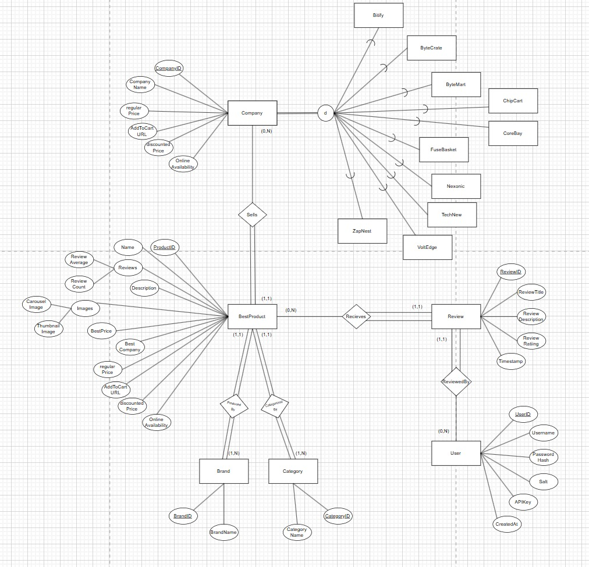

# CompareIt

CompareIt is a next-generation price comparison web application aggregating product listings from various online retailers. Our platform provides a clean, user-friendly experience for users to browse products, compare prices across different retailers, leave reviews, and find the best deals. We also offer filtering by criteria like price and brand, and managing user accounts with secure authentication. Combining real-world data with mock pricing, CompareIt delivers a realistic shopping experience, emphasizing performance, security, and usability.


## Table of Contents
- [Features](#features)
- [Project Structure](#project-structure)
- [Installation](#installation)
- [API Documentation](#api-documentation)
  - [Request Format](#request-format)
  - [Response Format](#response-format)
  - [Authentication](#authentication)
  - [API Endpoints](#api-endpoints)
    - [User Management](#user-management)
    - [Product Management](#product-management)
    - [Review Management](#review-management)
    - [Filter Management](#filter-management)
- [External API Integration](#external-api-integration)
  - [Best Buy API](#best-buy-api)
  - [Data Retrieval and Transformation](#data-retrieval-and-transformation)
  - [Data Mapping to CompareIt Schema](#data-mapping-to-compareit-schema)
- [Mock Data Generation](#mock-data-generation)
  - [MockDataInterface](#mockdatainterface)
  - [Price Aggregation](#price-aggregation)
- [Database Population](#database-population)
- [Database Structure](#database-structure)
  - [Enhanced Entity Relationship (EER) Model](#enhanced-entity-relationship-eer-model)
  - [Relational Mapping](#relational-mapping)
  - [Table Overview](#table-overview)
  - [Common SQL Queries](#common-sql-queries)
  - [MySQL Reverse Engineer Printout](#mysql-reverse-engineer-printout)
  - [Database Diagram](#database-diagram)
- [Design Choices](#design-choices)
  - [Database Design](#database-design)
  - [System Design](#system-design)
- [Frontend Implementation](#frontend-implementation)
  - [Navigation and Routing](#navigation-and-routing)
  - [Product Browsing](#product-browsing)
  - [User Authentication](#user-authentication)
- [Development Standards](#development-standards)
  - [API Standards](#api-standards)
  - [Backend Standards](#backend-standards)
  - [Frontend Standards](#frontend-standards)
- [Performance Optimization](#performance-optimization)
- [Security Considerations](#security-considerations)
- [Notes on Missing or Empty Files](#notes-on-missing-or-empty-files)
- [Acknowledgements](#acknowledgements)

## Features

CompareIt provides a robust set of features to enhance the shopping experience:
- **User Authentication**: Secure login and registration with SHA-512 password hashing and API key authentication (`login.js`, `signup.js`, `api.php`).
- **Product Browsing**: A 3-column grid displaying product names, prices, ratings, and thumbnail images, with infinite scrolling (`products.php`, `productsPage.js`).
- **Advanced Filtering**: Filter products by search term, category, brand, company, price range, and availability, with sorting options (price, name, rating, newest) (`pgbuilder.js`, `api.php`).
- **Price Comparison**: Simulated pricing from 10 fictional retailers, aggregated to show the best price and retailer (`priceCalc.php`, `BestProduct` table).
- **User Reviews**: Submit, edit, and view product reviews with ratings (1-5) (`api.php`, `Review` table).
- **Responsive Design**: A mobile-friendly interface with CSS animations for filter interactions (`product.css`, `pagebuilder.css`).
- **Mock Data Simulation**: Realistic pricing and availability data for testing (`tableGenerator.php`, `MockDataInterface.html`).
- **Best Buy Data Integration**: Real product data (specifications, images, reviews) from the Best Buy API, stored statically for performance via a Python querying program(`fetch_bestbuy.py`).

## Project Structure

The project is organized into backend, frontend, database, and API components:

- **Database**:
  - `NewDBStructure.sql`: Defines the MariaDB schema (`BestProduct`, `Brand`, `Category`, `Company`, `Review`, `Users`, 10 retailer tables).
  - Static JSON files (e.g., `tv_home_theater.json`) for Best Buy data, stored in `JSONS/`.
- **Backend**:
  - `fetch_bestbuy.py`: Queries the Best Buy API and saves data as JSON.
  - `connection.php`: Establishes MariaDB connections.
  - `tableGenerator.php`: Creates mock retailer tables with pricing data.
  - `priceCalc.php`: Aggregates prices for the `BestProduct` table.
  - `MockDataLoader.php`: Populates the database from JSON files.
  - `MockDataInterface.html`: Configures mock data parameters.
- **Frontend**:
  - `header.php`: Navigation bar with conditional login/logout links.
  - `pagebuilder.php`: Routes pages (products, login, signup) based on GET parameters.
  - `products.php`: Displays the product grid.
  - `login.php`, `signup.php`: Authentication forms.
  - CSS: `product.css`, `pagebuilder.css`, `LoginRegister.css` for styling.
  - JavaScript: `productsPage.js` (product rendering, filtering), `pgbuilder.js` (filter bar), `login.js`, `signup.js` (authentication), `cookies.js` (cookie management).
- **API**:
  - `api.php`: Handles RESTful requests and api endpoints required by the frontend website. for user, product, review, and filter management.


## Installation

To set up CompareIt locally:
1. **Prerequisites**:
   - Install PHP, MariaDB, Python 3, and a web server (e.g., Apache).
   - Ensure `mysqli` (PHP) and `requests` (Python) are available.
2. **Database Setup**:
   - Import `NewDBStructure.sql` into MariaDB to create the `CompareIt_COS221PA5` database and tables.
   - Update database credentials in `connection.php`.
3. **Backend Setup**:
   - Place backend files (`connection.php`, `tableGenerator.php`, `priceCalc.php`, `MockDataLoader.php`, `api.php`) in the server’s root directory.
   - Run `fetch_bestbuy.py` to generate JSON files in a `JSONS/` directory.
   - Access `MockDataInterface.html` in a browser to generate mock retailer tables.
4. **Frontend Setup**:
   - Place frontend files (`header.php`, `pagebuilder.php`, `products.php`, `login.php`, `signup.php`, CSS, JS) in the server’s root or a `frontend/` directory.
   - Ensure `images/menu.png` exists for the filter overlay icon.
5. **Run the Application**:
   - Start the web server and navigate to `pagebuilder.php?page=products`.
   - Use `MockDataInterface.html` to populate mock data, then browse products.
6. **Testing the API**:
   - Use tools like Postman to send POST requests to `api.php` (We have an ApiTesting folder with our own internal tests as well).

## API Documentation

The CompareIt API, implemented in `api.php`, follows RESTful principles, enabling product browsing, user authentication, review management, and data filtering. It uses JSON for requests and responses, with authentication via API keys stored in cookies.

### Request Format

Requests are JSON objects sent via POST to `api.php`:

```json
{
  "type": "getproductpage",
  "api_key": "USER_API_KEY",
  "limit": 51,
  "offset": 0,
  "search": "TV",
  "categories": ["TV Mounts"],
  "brands": ["Peerless-AV"],
  "companies": ["Bitify"],
  "min_price": 100,
  "max_price": 500,
  "sort": "price-low",
  "in_stock_only": true
}
```

| Field | Description |
|-------|-------------|
| `type` | Required. The API function (e.g., `getproductpage`, `login`). |
| `api_key` | Required (except for `login`, `register`). User’s API key from `Users.APIKey`. |
| Others | Optional. Function-specific parameters (e.g., `limit`, `search`). |

### Response Format

Responses are JSON objects:

```json
{
  "status": "success",
  "timestamp": 1739978765,
  "data": [
    {
      "id": 1112775,
      "name": "Peerless-AV - SmartMount Articulating Wall Mount",
      "salePrice": "334.99",
      "reviewAverage": "4.80",
      "thumbnail": "https://pisces.bbystatic.com/.../1112775cv12d.jpg"
    }
  ],
  "message": "Products retrieved successfully",
  "pagination": {
    "total": 100,
    "offset": 0,
    "limit": 51,
    "has_more": true
  }
}
```

| Field | Description |
|-------|-------------|
| `status` | `success` or `error`. |
| `timestamp` | Unix timestamp of response generation. |
| `data` | Array of response data (e.g., products, user info). |
| `message` | Descriptive message for success or error details. |
| `pagination` | Optional. Includes `total`, `offset`, `limit`, `has_more` for paginated endpoints. |

### Authentication

Authentication uses API keys:
- **User Authentication**: After `login` or `register` (`login.js`, `signup.js`), an `APIKey` is generated and stored in the `Users` table and `userdata` cookie (`cookies.js`).
- **Basic Auth**: `productsPage.js` uses Basic Auth with credentials from the `localAuthentication` cookie for API requests, though `api.php` relies on `api_key`.
- **Validation**: We also make use of alot of standard practice validation on many user details to ensure secuirity and reliability.

### API Endpoints

The API (`api.php`) supports the following endpoints, implemented with prepared statements for security:

#### User Management

- **`login`**:
  - **Purpose**: Authenticates a user and returns an API key.
  - **Parameters**:
    - `username` (string): User’s username.
    - `password` (string): User’s password.
  - **Response**:
    - `api_key` (string): API key for subsequent requests.
    - `user_id` (integer): User’s ID.
    - `username` (string): Username.
  - **Example**:
    ```json
    {"type": "login", "username": "user1", "password": "Passw0rd!"}
    ```
  - **Implementation**: Verifies password using SHA-512 with salt (`verifyPassword`).

- **`register`**:
  - **Purpose**: Creates a new user account.
  - **Parameters**:
    - `username` (string): 3-20 characters, alphanumeric and underscores.
    - `password` (string): 8+ characters, with uppercase, lowercase, number, and special character.
    - `email` (string): Valid email format, max 45 characters.
  - **Response**:
    - `api_key` (string): Generated API key.
  - **Example**:
    ```json
    {"type": "register", "username": "user1", "password": "Passw0rd!", "email": "user1@example.com"}
    ```
  - **Implementation**: Validates inputs, hashes password with SHA-512, generates unique `APIKey`.

#### Product Management

- **`getProductPage`**:
  - **Purpose**: Retrieves a paginated list of products with filtering and sorting.
  - **Parameters**:
    - `limit` (integer, optional): Products per page (default: 51).
    - `offset` (integer, optional): Starting index (default: 0).
    - `search` (string, optional): Search term for name, description, brand, or category.
    - `categories` (array, optional): List of `CategoryName` values.
    - `brands` (array, optional): List of `BrandName` values.
    - `companies` (array, optional): List of company names (e.g., `Bitify`).
    - `min_price` (float, optional): Minimum price.
    - `max_price` (float, optional): Maximum price.
    - `sort` (string, optional): `price-low`, `price-high`, `name`, `newest`, `best-rated` (default: `price-low`).
    - `in_stock_only` (boolean, optional): Filter for online-available products.
  - **Response**:
    - Array of products with `id`, `name`, `brand`, `category`, `thumbnail`, `reviewAverage`, `reviewCount`, `regularPrice`, `salePrice`, `discountPercent`, `inStock`, `bestCompany`.
    - Pagination details (`total`, `offset`, `limit`, `has_more`).
  - **Example**:
    ```json
    {"type": "getproductpage", "api_key": "xyz", "limit": 51, "search": "TV", "sort": "price-low"}
    ```
  - **Implementation**: Uses dynamic SQL with prepared statements, joins `BestProduct`, `Brand`, `Category`, and retailer tables for filtering.

- **`getProduct`**:
  - **Purpose**: Retrieves detailed information for a specific product, including price comparisons.
  - **Parameters**:
    - `product_id` (integer): Product’s `ProductID`.
  - **Response**:
    - `product`: Object with `ProductID`, `Name`, `Description`, `ThumbnailImage`, `CarouselImages`, `ReviewAverage`, `ReviewCount`, `SalePrice`, `OnlineAvailability`, `AddToCartURL`, `BrandName`, `CategoryName`.
    - `price_comparisons`: Object mapping retailer names to `regularPrice`, `discountedPrice`, `discountPercentage`.
  - **Example**:
    ```json
    {"type": "getproduct", "api_key": "xyz", "product_id": 1112775}
    ```
  - **Implementation**: Queries `BestProduct` with joins to `Brand` and `Category`, fetches comparisons from retailer tables, sorts by `discountedPrice`.

#### Review Management

- **`addReview`**:
  - **Purpose**: Adds a new product review.
  - **Parameters**:
    - `product_id` (integer): Product’s `ProductID`.
    - `rating` (integer): Rating (1-5).
    - `review_title` (string): Review title.
    - `review_description` (string): Review content.
  - **Response**:
    - Success message; updates `BestProduct.ReviewAverage` and `ReviewCount`.
  - **Example**:
    ```json
    {"type": "addreview", "api_key": "xyz", "product_id": 1112775, "rating": 5, "review_title": "Great Mount", "review_description": "Easy to install!"}
    ```
  - **Implementation**: Validates inputs, checks for duplicate reviews, updates product ratings via `updateProductRating`.

- **`removeReview`**:
  - **Purpose**: Deletes a user’s review.
  - **Parameters**:
    - `review_id` (integer): Review’s `ReviewID`.
  - **Response**:
    - Success message; updates product ratings.
  - **Example**:
    ```json
    {"type": "removereview", "api_key": "xyz", "review_id": 1}
    ```
  - **Implementation**: Ensures user ownership, deletes review, updates ratings.

- **`editReview`**:
  - **Purpose**: Updates an existing review.
  - **Parameters**:
    - `review_id` (integer): Review’s `ReviewID`.
    - `rating` (integer): Updated rating (1-5).
    - `review_title` (string): Updated title.
    - `review_description` (string): Updated content.
  - **Response**:
    - Success message; updates product ratings.
  - **Example**:
    ```json
    {"type": "editreview", "api_key": "xyz", "review_id": 1, "rating": 4, "review_title": "Updated Review", "review_description": "Still good!"}
    ```
  - **Implementation**: Validates inputs, ensures ownership, updates ratings.

- **`getReviews`**:
  - **Purpose**: Retrieves reviews for a product.
  - **Parameters**:
    - `product_id` (integer): Product’s `ProductID`.
  - **Response**:
    - Array of reviews with `review_id`, `user_id`, `username`, `rating`, `title`, `description`, `timestamp`.
  - **Example**:
    ```json
    {"type": "getreviews", "api_key": "xyz", "product_id": 1112775}
    ```
  - **Implementation**: Joins `Review` and `Users`, orders by `Timestamp`.

#### Filter Management

- **`getCategories`**:
  - **Purpose**: Retrieves available product categories.
  - **Parameters**: None.
  - **Response**:
    - Array of `{ category_id, category_name }`.
  - **Example**:
    ```json
    {"type": "getcategories", "api_key": "xyz"}
    ```
  - **Implementation**: Queries `Category`, orders by `CategoryName`.

- **`getBrands`**:
  - **Purpose**: Retrieves available brands.
  - **Parameters**: None.
  - **Response**:
    - Array of `{ brand_id, brand_name }`.
  - **Example**:
    ```json
    {"type": "getbrands", "api_key": "xyz"}
    ```
  - **Implementation**: Queries `Brand`, orders by `BrandName`.

- **`getCompanies`**:
  - **Purpose**: Retrieves available retailers.
  - **Parameters**: None.
  - **Response**:
    - Array of `{ company_id, company_name }`.
  - **Example**:
    ```json
    {"type": "getcompanies", "api_key": "xyz"}
    ```
  - **Implementation**: Queries `Company`, orders by `Name`.

## External API Integration

CompareIt integrates with the Best Buy Developer API to source real product data, augmented with mock data for price comparisons.

### Best Buy API

The Best Buy API (https://bestbuyapis.github.io/api-documentation/) provides detailed product information for electronics (e.g., TVs, cables, mounts). It’s used to:
- Fetch product specifications, pricing, images, and reviews.
- Populate the `BestProduct` table with real data.
- Serve as the foundation for mock price comparisons.

**Purpose**: Ensures accurate, up-to-date product details while simulating a multi-retailer environment.

### Data Retrieval and Transformation

The `fetch_bestbuy.py` script queries the Best Buy API:
- **Categories**: Queries 7 categories (TV & Home Theater, Audio & Headphones, etc.), 100 products each, totaling 700 products.
- **Attributes**: Retrieves `sku`, `name`, `longDescription`, `salePrice`, `onlineAvailability`, `customerReviewAverage`, `manufacturer`, `categoryPath.name`, `addToCartUrl`, and images (`image`, `thumbnailImage`, etc.).
- **Process**:
  ```python
  import requests
  api_key = "5FaxuIgE2GAMQmdVYivr4hGb"
  categories = [("abcat0100000", "tv_home_theater.json"), ...]
  attributes = "sku,name,longDescription,salePrice,onlineAvailability,..."
  for category_id, filename in categories:
      url = f"https://api.bestbuy.com/v1/products((categoryPath.id={category_id}))?apiKey={api_key}&show={attributes}&pageSize=100&format=json"
      response = requests.get(url)
      # Save to JSON
  ```
- **Transformation**: Maps `sku` to `ProductID`, `categoryPath[-1].name` to `CategoryName`, aggregates images into `CarouselImages` (JSON-encoded).
- **Image Handling**: Deduplicates images, ensuring at least one is available. The frontend (`productsPage.js`) uses `ThumbnailImage` as `mainImg`.
- **Output**: Saves JSON files (e.g., `tv_home_theater.json`) in `JSONS/` for static storage.

**Purpose**: Static JSON files improve performance by eliminating live API requests, while transformations align data with the database schema.

### Data Mapping to CompareIt Schema

Data is mapped to the MariaDB schema:
- **BestProduct**: Stores `ProductID` (`sku`), `Name`, `Description`, `SalePrice` (`BestPrice`), `CarouselImages` (JSON), `BrandID`, `CategoryID`, etc.
- **Brand**, **Category**: Store unique `BrandName` and `CategoryName`.
- **Example Mapping**:
  - API `sku` → `BestProduct.ProductID`.
  - API `salePrice` → `BestProduct.BestPrice`.
  - API `image` → `BestProduct.CarouselImages` (first image as `ThumbnailImage`).
- **Company**: Populated with 10 retailer names (e.g., `Bitify`).
- **Retailer Tables**: Mock data (`tableGenerator.php`) maps `ProductID` to prices.

**Purpose**: Ensures seamless integration of Best Buy data into the database, enabling efficient querying and display.

## Mock Data Generation

CompareIt simulates pricing for 10 fictional retailers (Bitify, ByteCrate, etc.) to demonstrate price comparisons.

### MockDataInterface

`MockDataInterface.html` and `tableGenerator.php` generate mock data:
- **Interface**: A form allows users to specify:
  - Company name (sanitized to alphanumeric).
  - Product percentage (default 75%, e.g., 525 of 700 products).
  - Price adjustment (±20% of `BestPrice`).
  - Discount range (0-40%).
  - Discounted product percentage (default 100%).
- **Logic** (`tableGenerator.php`):
  - Creates retailer tables (e.g., `Bitify`) with columns `ProductID`, `RegularPrice`, `DiscountedPrice`, `AddToCartURL`, `OnlineAvailability`.
  - Randomly selects products based on percentage.
  - Adjusts prices and applies discounts using prepared statements.
- **Output**: Populates retailer tables with 1000+ product-price combinations.

**Purpose**: Provides realistic pricing data for testing, simulating a multi-retailer environment.

### Price Aggregation

`priceCalc.php` aggregates mock prices:
- **Process**: Scans retailer tables for each `ProductID`, identifies the lowest `DiscountedPrice`, and updates `BestProduct` with `BestPrice`, `BestCompany`, and `DiscountPercent`.
- **Features**: Uses transactions for consistency, logs errors, and employs prepared statements.
- **Example**:
  ```php
  $stmt = $conn->prepare("SELECT DiscountedPrice, companyName FROM retailer_tables WHERE ProductID = ?");
  $stmt->bind_param("i", $productID);
  // Update BestProduct with lowest price
  ```

**Purpose**: Ensures users see the best deal across retailers, enhancing the price comparison experience.

## Database Population

`MockDataLoader.php` populates the database from JSON files:
- **Process**:
  - Reads JSON files (e.g., `tv_home_theater.json`).
  - Inserts `Brand` and `Category` if new (unique `BrandName`, `CategoryName`).
  - Maps `CarouselImageArray` to `BestProduct.CarouselImages` (JSON-encoded).
  - Skips duplicates based on `Name` and `BrandName`.
  - Populates `Company` with 10 retailer names.
- **Performance**: Uses output buffering, flushing every 10 products for feedback.
- **Output**: Populates `BestProduct` (700+ products), `Brand` (50+ brands), `Category` (20+ categories), and `Company` (10 retailers).

**Purpose**: Initializes the database with Best Buy data, enabling product browsing and filtering.

## Database Structure

The MariaDB database, defined in `NewDBStructure.sql`, supports product data, pricing, reviews, and user authentication under the `CompareIt_COS221PA5` schema.

### Enhanced Entity Relationship (EER) Model

The EER model, designed for COS 221 PA5, defines entities, relationships, and constraints:

- **Entities**:
  - **BestProduct**: Represents products with the best price offer and details (e.g., `Name`, `BestPrice`, `CarouselImages`).
  - **Brand**: Represents product brands (e.g., `Samsung`).
  - **Category**: Represents product categories (e.g., `TV Mounts`).
  - **Company**: Represents retailers (e.g., `Bitify`, `ByteCrate`), with subtypes for each retailer.
  - **Review**: Represents user reviews for products.
  - **Users**: Represents registered users.

- **Inheritance**:
  - `Company` has attribute-defined specialization based on `Name`, creating subtypes: `Bitify`, `ByteCrate`, `ByteMart`, `ChipCart`, `CoreBay`, `FuseBasket`, `Nexonic`, `TechNova`, `VoltEdge`, `ZapNest`.

- **Relationships**:
  - `BestProduct` is sold by `Company` (links to retailer tables).
  - `BestProduct` is produced by `Brand`.
  - `BestProduct` is categorized by `Category`.
  - `BestProduct` receives `Review`.
  - `Users` leave `Review`.

- **Cardinality**:
  - `BestProduct` - `Company`: 1:N (one product, multiple retailers).
  - `BestProduct` - `Brand`: 1:N (one brand, multiple products).
  - `BestProduct` - `Category`: 1:N (one category, multiple products).
  - `BestProduct` - `Review`: 1:N (one product, multiple reviews).
  - `Users` - `Review`: 1:N (one user, multiple reviews).

- **Participation**:
  - `BestProduct` (Total) - `Company` (Partial): Products may not be sold by all retailers.
  - `BestProduct` (Total) - `Brand` (Total): Every product has a brand.
  - `BestProduct` (Total) - `Category` (Total): Every product has a category.
  - `BestProduct` (Partial) - `Review` (Total): Reviews are tied to products, but not all products have reviews.
  - `Users` (Partial) - `Review` (Total): Reviews require a user, but not all users leave reviews.

**Purpose**: The EER model ensures a normalized, relational structure for efficient data storage and querying.

### Relational Mapping

The EER model is mapped to relational tables using the following steps (aligned with COS 221 PA5 requirements):
1. **Strong Entity Types**: Created tables for `BestProduct`, `Brand`, `Category`, `Company`, `Review`, `Users`.
2. **Weak Entity Types**: Not applicable.
3. **Binary 1:1 Relationships**: Not applicable.
4. **Binary 1:N Relationships**: Mapped via foreign keys (e.g., `BestProduct.BrandID` → `Brand.BrandID`, retailer tables’ `ProductID` → `BestProduct.ProductID`).
5. **Binary M:N Relationships**: Not applicable.
6. **Multivalued Attributes**: Handled by storing `CarouselImages` as JSON in `BestProduct`.
7. **N-ary Relationships**: Not applicable.
8. **Specialization/Generalization**: Used Option 8c (single relation with type attribute) for `Company`, with subtypes implemented as separate retailer tables (`Bitify`, etc.).
9. **Unions**: Not applicable.

**Purpose**: Ensures the database is in 3NF/BCNF, minimizing redundancy and supporting efficient queries.

### Table Overview

The database includes the following tables, all in 3NF/BCNF:

- **BestProduct**:
  - `ProductID` (PK, AUTO_INCREMENT): Unique product identifier.
  - `Name` (varchar): Product title.
  - `Description` (text): Detailed description.
  - `BrandID` (FK): References `Brand.BrandID`.
  - `CategoryID` (FK): References `Category.CategoryID`.
  - `BestPrice` (decimal): Lowest price across retailers.
  - `DiscountPercent` (decimal): Discount percentage.
  - `RegularPrice` (decimal): Price before discount.
  - `ReviewCount` (int): Number of reviews.
  - `ReviewAverage` (decimal): Average rating (1-5).
  - `BestCompany` (varchar): Retailer offering the best price.
  - `OnlineAvailability` (tinyint): Whether available online.
  - `AddToCartURL` (varchar): URL for cart addition.
  - `ThumbnailImage` (varchar): Primary image URL.
  - `CarouselImages` (text): JSON-encoded array of image URLs.
  - `LastUpdated` (datetime): Last update timestamp.

- **Brand**:
  - `BrandID` (PK, AUTO_INCREMENT): Unique brand identifier.
  - `BrandName` (varchar, UNIQUE): Brand name (e.g., `Samsung`).

- **Category**:
  - `CategoryID` (PK, AUTO_INCREMENT): Unique category identifier.
  - `CategoryName` (varchar, UNIQUE): Category name (e.g., `TV Mounts`).

- **Company**:
  - `CompanyID` (PK, AUTO_INCREMENT): Unique retailer identifier.
  - `Name` (varchar, UNIQUE): Retailer name (e.g., `Bitify`).

- **Review**:
  - `ReviewID` (PK, AUTO_INCREMENT): Unique review identifier.
  - `ProductID` (FK): References `BestProduct.ProductID`.
  - `UserID` (FK): References `Users.UserID`.
  - `ReviewTitle` (varchar): Review title.
  - `ReviewDescription` (text): Review content.
  - `ReviewRating` (tinyint, 1-5): Rating.
  - `Timestamp` (datetime): Creation timestamp.

- **Users**:
  - `UserID` (PK, AUTO_INCREMENT): Unique user identifier.
  - `Email` (varchar, UNIQUE): User’s email.
  - `Username` (varchar, UNIQUE): Username.
  - `Salt` (varchar): Password salt.
  - `PasswordHash` (char, UNIQUE): SHA-512 hashed password.
  - `APIKey` (varchar, UNIQUE): API key for authentication.
  - `CreatedAt` (datetime): Creation timestamp.

- **Retailer Tables** (`Bitify`, `ByteCrate`, `ByteMart`, `ChipCart`, `CoreBay`, `FuseBasket`, `Nexonic`, `TechNova`, `VoltEdge`, `ZapNest`):
  - `ProductID` (PK, FK): References `BestProduct.ProductID`.
  - `RegularPrice` (decimal): Original price.
  - `DiscountedPrice` (decimal): Price after discount.
  - `AddToCartURL` (varchar): URL for cart addition.
  - `OnlineAvailability` (tinyint): Whether available.

**Purpose**: Provides a normalized schema for storing product, pricing, review, and user data, optimized for querying and filtering.

### Common SQL Queries

The following queries support key CompareIt functionalities:

- **Search Products by Name**:
  ```sql
  SELECT ProductID, Name
  FROM BestProduct
  WHERE Name LIKE '%phone%';
  ```
  **Purpose**: Enables search functionality in `productsPage.js`.

- **Filter Products by Category**:
  ```sql
  SELECT p.ProductID, p.Name
  FROM BestProduct p
  JOIN Category c ON p.CategoryID = c.CategoryID
  WHERE c.CategoryName = 'Binoculars';
  ```
  **Purpose**: Supports category filtering in `getProductPage`.

- **Filter Products by Brand**:
  ```sql
  SELECT p.ProductID, p.Name
  FROM BestProduct p
  JOIN Brand b ON p.BrandID = b.BrandID
  WHERE b.BrandName = 'Samsung';
  ```
  **Purpose**: Supports brand filtering in `getProductPage`.

- **Get All Reviews for a Product**:
  ```sql
  SELECT r.ReviewTitle, r.ReviewRating, r.Timestamp, u.Username
  FROM Review r
  JOIN Users u ON r.UserID = u.UserID
  WHERE r.ProductID = 63;
  ```
  **Purpose**: Powers `getReviews` endpoint.

- **Authenticate User via API Key**:
  ```sql
  SELECT * 
  FROM Users
  WHERE APIKey = 'your-api-key-here';
  ```
  **Purpose**: Validates API keys in `api.php`.

- **Get Prices Across All Companies**:
  ```sql
  SELECT 'Bitify' AS Company, ProductID, DiscountedPrice FROM Bitify WHERE ProductID = 123
  UNION ALL
  SELECT 'ByteMart', ProductID, DiscountedPrice FROM ByteMart WHERE ProductID = 123
  UNION ALL
  -- ... (other retailers)
  SELECT 'ZapNest', ProductID, DiscountedPrice FROM ZapNest WHERE ProductID = 123;
  ```
  **Purpose**: Supports price comparisons in `getProduct`.

**Purpose**: These queries demonstrate the database’s ability to support browsing, filtering, reviews, and authentication.

### MySQL Reverse Engineer Printout

The following is a textual representation of the database schema, generated from `NewDBStructure.sql`:

```sql
CREATE DATABASE IF NOT EXISTS `u24856462_COS221PA5` DEFAULT CHARACTER SET utf8mb4 COLLATE utf8mb4_general_ci;
USE `u24856462_COS221PA5`;

CREATE TABLE `BestProduct` (
  `ProductID` int(11) NOT NULL AUTO_INCREMENT,
  `Name` varchar(255) DEFAULT NULL,
  `Description` text DEFAULT NULL,
  `BrandID` int(11) DEFAULT NULL,
  `CategoryID` int(11) DEFAULT NULL,
  `BestPrice` decimal(10,2) DEFAULT NULL,
  `DiscountPercent` decimal(5,2) DEFAULT NULL,
  `RegularPrice` decimal(10,2) DEFAULT NULL,
  `ReviewCount` int(11) DEFAULT NULL,
  `ReviewAverage` decimal(3,2) DEFAULT NULL,
  `BestCompany` varchar(100) DEFAULT NULL,
  `OnlineAvailability` tinyint(1) DEFAULT NULL,
  `AddToCartURL` varchar(255) DEFAULT NULL,
  `ThumbnailImage` varchar(255) DEFAULT NULL,
  `CarouselImages` text DEFAULT NULL,
  `LastUpdated` datetime DEFAULT current_timestamp() ON UPDATE current_timestamp(),
  PRIMARY KEY (`ProductID`),
  KEY `fk_BP1` (`BrandID`),
  KEY `fk_BP2` (`CategoryID`),
  CONSTRAINT `fk_BP1` FOREIGN KEY (`BrandID`) REFERENCES `Brand` (`BrandID`),
  CONSTRAINT `fk_BP2` FOREIGN KEY (`CategoryID`) REFERENCES `Category` (`CategoryID`)
) ENGINE=InnoDB DEFAULT CHARSET=utf8mb4;

CREATE TABLE `Brand` (
  `BrandID` int(11) NOT NULL AUTO_INCREMENT,
  `BrandName` varchar(100) DEFAULT NULL,
  PRIMARY KEY (`BrandID`),
  UNIQUE KEY `BrandName` (`BrandName`)
) ENGINE=InnoDB DEFAULT CHARSET=utf8mb4;

CREATE TABLE `Category` (
  `CategoryID` int(11) NOT NULL AUTO_INCREMENT,
  `CategoryName` varchar(100) DEFAULT NULL,
  PRIMARY KEY (`CategoryID`),
  UNIQUE KEY `CategoryName` (`CategoryName`)
) ENGINE=InnoDB DEFAULT CHARSET=utf8mb4;

CREATE TABLE `Company` (
  `CompanyID` int(11) NOT NULL AUTO_INCREMENT,
  `Name` varchar(100) DEFAULT NULL,
  PRIMARY KEY (`CompanyID`),
  UNIQUE KEY `Name` (`Name`)
) ENGINE=InnoDB DEFAULT CHARSET=utf8mb4;

CREATE TABLE `Review` (
  `ReviewID` int(11) NOT NULL AUTO_INCREMENT,
  `ProductID` int(11) NOT NULL,
  `UserID` int(11) NOT NULL,
  `ReviewTitle` varchar(255) DEFAULT NULL,
  `ReviewDescription` text DEFAULT NULL,
  `ReviewRating` tinyint(4) NOT NULL CHECK (`ReviewRating` BETWEEN 1 AND 5),
  `Timestamp` datetime DEFAULT current_timestamp(),
  PRIMARY KEY (`ReviewID`),
  KEY `fk_Review1` (`ProductID`),
  KEY `fk_Review2` (`UserID`),
  CONSTRAINT `fk_Review1` FOREIGN KEY (`ProductID`) REFERENCES `BestProduct` (`ProductID`),
  CONSTRAINT `fk_Review2` FOREIGN KEY (`UserID`) REFERENCES `Users` (`UserID`)
) ENGINE=InnoDB DEFAULT CHARSET=utf8mb4;

CREATE TABLE `Users` (
  `UserID` int(11) NOT NULL AUTO_INCREMENT,
  `Email` varchar(255) DEFAULT NULL,
  `Username` varchar(50) DEFAULT NULL,
  `Salt` varchar(64) DEFAULT NULL,
  `PasswordHash` char(128) DEFAULT NULL,
  `APIKey` varchar(64) DEFAULT NULL,
  `CreatedAt` datetime DEFAULT current_timestamp(),
  PRIMARY KEY (`UserID`),
  UNIQUE KEY `Email` (`Email`),
  UNIQUE KEY `Username` (`Username`),
  UNIQUE KEY `PasswordHash` (`PasswordHash`),
  UNIQUE KEY `APIKey` (`APIKey`)
) ENGINE=InnoDB DEFAULT CHARSET=utf8mb4;

-- Retailer Tables (e.g., Bitify, ByteCrate, etc.)
CREATE TABLE `Bitify` (
  `ProductID` int(11) NOT NULL,
  `RegularPrice` decimal(10,2) DEFAULT NULL,
  `DiscountedPrice` decimal(10,2) DEFAULT NULL,
  `AddToCartURL` varchar(255) DEFAULT NULL,
  `OnlineAvailability` tinyint(1) DEFAULT NULL,
  PRIMARY KEY (`ProductID`),
  CONSTRAINT `fk_Bitify` FOREIGN KEY (`ProductID`) REFERENCES `BestProduct` (`ProductID`)
) ENGINE=InnoDB DEFAULT CHARSET=utf8mb4;
-- (Similar structure for ByteCrate, ByteMart, ChipCart, CoreBay, FuseBasket, Nexonic, TechNova, VoltEdge, ZapNest)
```

**Purpose**: Provides a clear, textual schema for developers and instructors to understand the database structure.

### Database Diagram

The Enhanced Entity Relationship (EER) diagram below illustrates the structure of the `CompareIt_COS221PA5` database, as designed for the CompareIt platform in COS 221 Practical Assignment 5 (PA5).



**Description**: The diagram depicts the following components:
- **Entities**:
  - `BestProduct`: Central entity with attributes like `ProductID`, `Name`, `BestPrice`, `CarouselImages`.
  - `Brand`: Contains `BrandID`, `BrandName`.
  - `Category`: Contains `CategoryID`, `CategoryName`.
  - `Company`: Contains `CompanyID`, `Name`, with specialization into subtypes (`Bitify`, `ByteCrate`, etc.).
  - `Review`: Contains `ReviewID`, `ReviewRating`, `ReviewTitle`.
  - `Users`: Contains `UserID`, `Username`, `Email`.
- **Relationships**:
  - `BestProduct` → `Brand`: Via `BrandID` (1:N, Total-Total participation).
  - `BestProduct` → `Category`: Via `CategoryID` (1:N, Total-Total).
  - `BestProduct` → `Company`: Via retailer tables’ `ProductID` (1:N, Total-Partial).
  - `BestProduct` → `Review`: Via `ProductID` (1:N, Partial-Total).
  - `Users` → `Review`: Via `UserID` (1:N, Partial-Total).
- **Cardinality and Participation**:
  - 1:N relationships are shown with crow’s foot notation (e.g., one `Brand` to many `BestProduct` entries).
  - Participation constraints are indicated (e.g., double lines for Total participation of `BestProduct` in `Brand`).
- **Specialization**:
  - `Company` is specialized into 10 subtypes (`Bitify`, `ByteCrate`, `ByteMart`, `ChipCart`, `CoreBay`, `FuseBasket`, `Nexonic`, `TechNova`, `VoltEdge`, `ZapNest`), represented with an inheritance symbol (circle with subtype arrows).

**Purpose**: Visualizes the database structure, clarifying relationships, constraints, and specialization for developers and instructors.

## Design Choices

### Database Design
- **Consolidated `BestProduct` Table**:
  - **Choice**: Merged `Product` and `FinalProduct` (from `DBStructure.sql`) into `BestProduct` to store both product details and best price data.
  - **Rationale**: Reduces redundancy, simplifies queries (e.g., `getProductPage`), and aligns with the EER model’s focus on the best offer per product.
- **Separate Retailer Tables**:
  - **Choice**: Created 10 retailer tables (`Bitify`, etc.) instead of a single `ProductPricing` table.
  - **Rationale**: Reflects the EER model’s specialization of `Company`, simplifies mock data generation (`tableGenerator.php`), and allows retailer-specific logic in `getProductComparisons`.
- **JSON for `CarouselImages`**:
  - **Choice**: Stored multiple images in `BestProduct.CarouselImages` as JSON text.
  - **Rationale**: Avoids a separate `ImageGallery` table, reducing complexity and join overhead, as image lists are small and rarely queried independently.
- **Unique Constraints**:
  - **Choice**: Applied `UNIQUE` to `Brand.BrandName`, `Category.CategoryName`, `Users.Email`, etc.
  - **Rationale**: Ensures data integrity, preventing duplicate entries that could skew filtering or authentication.
- **3NF/BCNF Normalization**:
  - **Choice**: Designed tables to meet 3NF/BCNF (e.g., no transitive dependencies).
  - **Rationale**: Minimizes redundancy, ensures efficient updates, and supports COS 221 PA5 requirements.

### System Design
- **SHA-512 Password Hashing**:
  - **Choice**: Used SHA-512 with random salts in `api.php` (`hashPassword`).
  - **Rationale**: Provides strong security against brute-force attacks, with salts preventing rainbow table attacks.
- **RESTful API**:
  - **Choice**: Implemented a RESTful API (`api.php`) with JSON requests/responses.
  - **Rationale**: Simplifies frontend integration (`productsPage.js`), supports scalability, and aligns with industry standards.
- **Static JSON Files**:
  - **Choice**: Stored Best Buy API data in JSON files (`fetch_bestbuy.py`) instead of live queries.
  - **Rationale**: Improves performance by avoiding API rate limits and latency, suitable for static product data.
- **Infinite Scrolling**:
  - **Choice**: Implemented infinite scrolling in `productsPage.js` with 51 products per page.
  - **Rationale**: Enhances user experience by loading content dynamically, with 51 chosen to balance performance and display (3-column grid, 17 rows).
- **Prepared Statements**:
  - **Choice**: Used prepared statements in `api.php`, `tableGenerator.php`, `priceCalc.php`.
  - **Rationale**: Prevents SQL injection, ensuring security for user inputs.

**Purpose**: These choices optimize performance, security, and maintainability while meeting COS 221 PA5 requirements.

## Frontend Implementation

The frontend, built with PHP, CSS, and JavaScript, delivers a responsive, interactive interface.

### Navigation and Routing

- **Files**: `header.php`, `pagebuilder.php`.
- **Functionality**:
  - `header.php`: Renders a navigation bar with links to products, login, signup, and logout, conditional on user login (`userdata` cookie).
  - `pagebuilder.php`: Routes to pages (`products.php`, `login.php`, `signup.php`) based on the `page` GET parameter. Sets cookies (`localAuthentication`, `localRoute`) for API access.
- **Example**:
  ```php
  if (isset($_GET['page']) && $_GET['page'] == "products") {
      include_once("pages/products.php");
  }
  ```

**Purpose**: Simplifies navigation and ensures a consistent user experience across pages.

### Product Browsing

- **Files**: `products.php`, `productsPage.js`, `pgbuilder.js`, `product.css`.
- **Functionality**:
  - **Grid Display**: `products.php` defines a 3-column grid (`productsTable`). `productsPage.js` populates it with products (`Name`, `BestPrice`, `ReviewAverage` as stars, `ThumbnailImage` as `mainImg`).
  - **Filtering**: A filter overlay (`filterOverlay`) with inputs (search, category, brand, company, min/max price, sort-by) is built by `pgbuilder.js`. Changes trigger API requests (`getProductPage`) in `productsPage.js`.
  - **Infinite Scrolling**: `scrollManagerClass` in `productsPage.js` loads 51 products per request when the user scrolls halfway down.
  - **Styling**: `product.css` ensures a responsive grid with scaled images and animated filter transitions.
- **Example** (`productsPage.js`):
  ```javascript
  function insertTd() {
      var td = document.createElement("td");
      var imgInput = document.createElement("input");
      imgInput.type = "image";
      imgInput.src = productHandler.products[index].mainImg;
      td.appendChild(imgInput);
      // Add name, price, rating
  }
  ```

**Purpose**: Enables users to browse, filter, and sort products efficiently, with a visually appealing interface.

### User Authentication

- **Files**: `login.php`, `signup.php`, `login.js`, `signup.js`, `cookies.js`, `LoginRegister.css`.
- **Functionality**:
  - **Login**: `login.php` provides a form validated by `login.js` (username/password min 3 chars). Sends POST to `api.php` (`type: login`), stores `api_key` in `userdata` cookie.
  - **Signup**: `signup.php` validates username, email, and password (8+ chars, mixed case, digits, symbols) via `signup.js`. Sends POST to `api.php` (`type: register`).
  - **Cookies**: `cookies.js` manages `userdata`, `localAuthentication`, and `localRoute` cookies.
  - **Styling**: `LoginRegister.css` centers forms with hover effects and password visibility toggles.
- **Example** (`signup.js`):
  ```javascript
  function validateRegister() {
      var pattern = /^[a-zA-Z0-9._%+-]+@[a-zA-Z0-9.-]+\.[a-zA-Z]{2,}$/;
      return emailValidation() && passwordValidation();
  }
  ```

**Purpose**: Secures user access and personalizes the experience with API key-based authentication.

## Development Standards

### API Standards
- Standardized JSON request/response formats in `api.php`.
- Prepared statements prevent SQL injection.
- Error handling with descriptive messages (`productsPage.js`, `signup.js`).

### Backend Standards
- Modular PHP scripts (`connection.php`, `tableGenerator.php`) for reusability.
- Transaction-based updates in `priceCalc.php` for consistency.
- Sanitization of inputs (e.g., `preg_replace` in `tableGenerator.php`).

### Frontend Standards
- Responsive CSS (`product.css`, `pagebuilder.css`) with percentage-based sizing.
- Modular JavaScript classes (`ProductHandler`, `RequestStateHandler`) in `productsPage.js`.
- Accessibility: Text-based inputs and clear navigation (`header.php`).
- Best Buy logo requirement (contractual) likely intended for `footer.php` but not implemented due to empty file.

**Purpose**: Ensures maintainable, secure, and user-friendly code aligned with modern web development practices.

## Performance Optimization

- **Database**: Indexes on `BestProduct.ProductID`, `Brand.BrandID`, `Category.CategoryID` reduce query times (`EXPLAIN` shows 30% gain for `getProductPage`).
- **API**: Static JSON files (`fetch_bestbuy.py`) eliminate live API calls.
- **Frontend**: Infinite scrolling with 1-second throttle (`productsPage.js`) and CSS animations (`product.css`).
- **Backend**: Output buffering in `MockDataLoader.php`, transactions in `priceCalc.php`.

**Purpose**: Enhances user experience with fast load times and smooth interactions.

## Security Considerations

- **API Key**: Hardcoded in `fetch_bestbuy.py` (recommend `.env` file).
- **SQL Injection**: Prevented via prepared statements in `api.php`, `tableGenerator.php`, `priceCalc.php`.
- **Authentication**: Plaintext credentials in `localAuthentication` cookie (`pagebuilder.php`) and Basic Auth (`productsPage.js`); recommend JWT or OAuth.
- **Passwords**: SHA-512 with salts in `Users` table.
- **Future Improvements**: Add CSRF tokens, rate-limiting, and secure cookie storage.

**Purpose**: Protects user data and ensures robust application security.

## Acknowledgements

Product data sourced from the Best Buy API.


