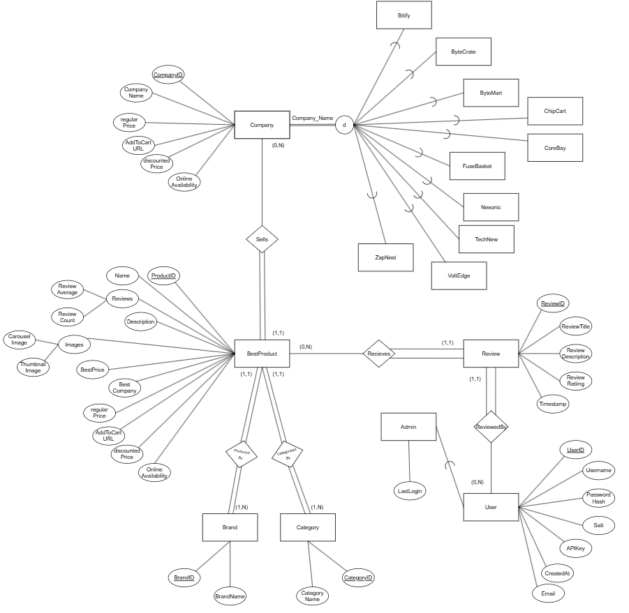
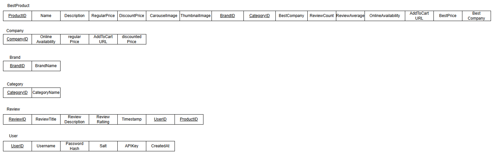
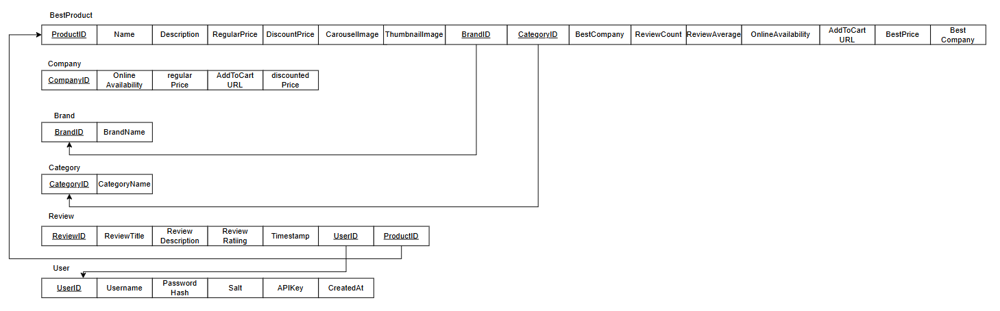
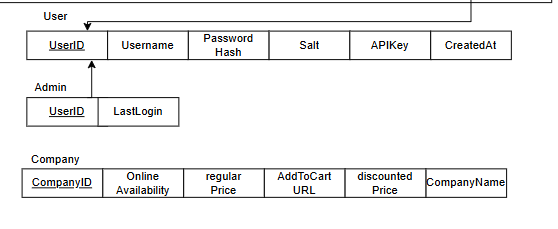
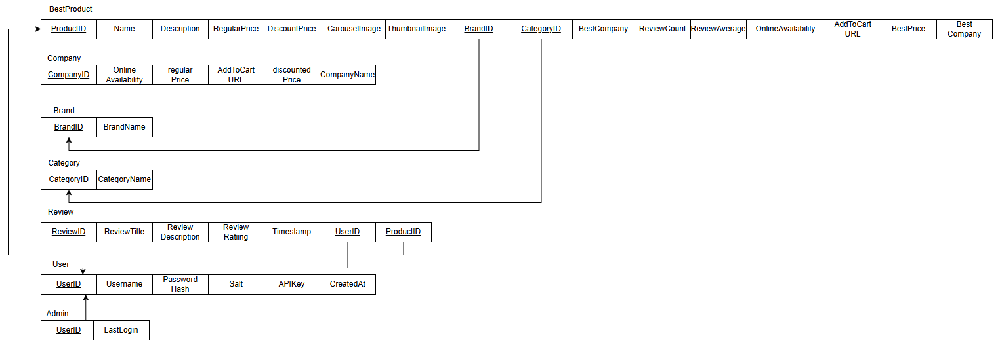
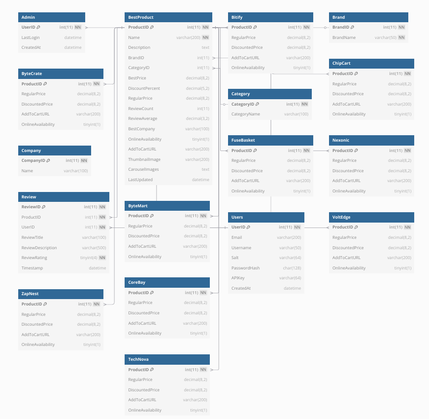

# CompareIt

CompareIt is a next-generation price comparison web application aggregating product listings from various online retailers. Our platform provides a clean, user-friendly experience for users to browse products, compare prices across different retailers, leave reviews, and find the best deals. We also offer filtering by criteria like price and brand, and managing user accounts with secure authentication. Combining real-world data with mock pricing, CompareIt delivers a realistic shopping experience, emphasizing performance, security, and usability.

## 418 Teapots Group Members

-   Damian Moustakis (u24564738)
-   Aaron Kim (u21494305)
-   Michael Tomlinson (u24569705)
-   Ayrtonn Taljaard (u24856462)
-   Dawid Eales (u24608892)
-   Wilmar Smit (u24584216)

## Table of Contents

-   [Market Research (Task 1)](#market-research-task-1)
-   [Mock Data Generation (Task 6)](#mock-data-generation-task-6)
-   [Development Guidelines (Task 8 & 10)](#development-guidelines-task-8--10)
-   [Demo Details (Task 9)](#demo-details-task-9)
-   [Database Design](#database-design)
    -   [Structure (Task 2)](#structure-task-2)
    -   [Relational Mapping (Task 3)](#relational-mapping-task-3)
    -   [Relational Constraints (Task 4)](#relational-constraints-task-4)
    -   [Optimisation (Task 7)](#optimisation-task-7)
-   [Website Functionality (Task 5)](#website-functionality-task-5)
    -   [API](#api)
    -   [Backend JS](#backend-js)
    -   [Frontend](#frontend)
-   [Individual Contributions](#individual-contributions)
    -   [Damian Moustakis (u24564738)](#damian-moustakis-u24564738)
    -   [Aaron Kim (u21494305)](#aaron-kim-u21494305)
    -   [Michael Tomlinson (u24569705)](#michael-tomlinson-u24569705)
    -   [Ayrtonn Taljaard (u24856462)](#ayrtonn-taljaard-u24856462)
    -   [Dawid Eales (u24608892)](#dawid-eales-u24608892)
    -   [Wilmar Smit (u24584216)](#wilmar-smit-u24584216)

## Market Research (Task 1)
### Competing Products
**Analyzed Competitors:**

- **PriceCheck**, **Smartprice**, **GoogleShopping** - Wide product range but poor user experience, confusing navigation
- **Troli** - Best UX focused on groceries only, clear onboarding process

**Key Gaps Identified:**

- Lack of technology product focus in South Africa
- Poor user guidance and functionality explanation
- No gamified or interactive design elements

**CompareIt Solution:**

- Technology-focused scope (laptops, desktops, components, consoles)
- Clean, gamified design with interactive elements
- Improved user experience addressing SA tech market markup issues

### Data Sources

- **Given API** choices - these didn't have good quality/enough data
- **Web scrapers** - questionable legality - hard to implement
- **eBay Developer API** - lots of variety between products - how do you easily compare iPhone to iPhone - without accidentally comparing an iPhone Case
- **Amazon Affiliate Program API** - unable to apply for Affiliate Program in South Africa
- **Best Buy Developer API** - Our Choice - Good Documentation - Able to get API key - easy to use query builder - lots of tech products - we decided to use this as a parent products dataset
## Mock Data Generation (Task 6)

### JSON Extraction
We tested the Best Buy API and choose several categories to give us a good spread of products:
- Appliances
- Audio Headphones
- Cameras
- Car Electronics
- Cell Phones
- Computers
- TV Home Theater

**[Best Buy API Data Extractor](MockDataTools/MockdataLoader/fetch_bestbuy.py)**

### Extracting Products from JSON
- Used PHP to insert products into a Best Products Table
- **[JSON to Database Product Extractor](MockDataTools/MockdataLoader)**

### Mock Data Generator & Generation
**[Mock Data Generator](MockDataTools/MockDataGenerationTool)**


### Price Calculation
Searched all the mock companies and find who offers the best price
Update the best products table

**[Price Calculator](MockDataTools/PriceCalculation)**

## Development Guidelines (Task 8 & 10)

### Git Workflow & Commits

- **Commit frequently** 
    - Commit when you complete a function/class, not at end of day
- **Detailed commit messages**
    - Other team members need to understand what you've implemented
- **Branch strategy**
    - Separate branches for each website section
- **Pull requests**
    - Testing and review process before merging to main branch
- **Only working code**
    - Ensure functionality works before committing to main
- **Config Protections**
    - Never commit a config.php file to the repo
    - It has been added to the git ignore and there are automated commit checks to detect when the credentials are attempted to be committed 

### Code Standards

- **Comment your code**
    - For teammate understanding and demo purposes
-  **Clear documentation**
    - All API requests and functionality should be documented in README
-  **Keep README current**
    - Should serve as living documentation for the project

## Demo Details (Task 9)
The website can be accessed locally through the provided localDemo.zip in the clickup submission 
The way that the files should be structured will be contained inside the localDemo zip and has only been tested to work using xamp and the directory within htdocs
The website should then be accessed through http://localhost/teapots/
The dump can be accessed in the database folder the sql file labeled final Schema. [final schema](database/Final%20Schema.sql)
This structure will mimic what is available on wheatley

The website can be accessed through the link https://wheatley.cs.up.ac.za/u24584216/teapots/
The username and password will be placed safely in the submission for clickup and will not appear on the readme
The data will be placed within config.php within the submission and will only contain the credentials to log into wheatley
This will be the main presentation version used in the demo.
## Database Design

### Structure (Task 2)

The Enhanced Entity Relationship (EER) diagram below illustrates the structure of the `CompareIt_COS221PA5` database, as designed for the CompareIt platform in the COS 221 Practical Assignment 5.



**Description**: The EER model defines the entities, relationships, and constraints of the database:
- **Entities**:
  - **BestProduct**: Represents products with the best price offer and details (e.g., `Name`, `BestPrice`, `CarouselImages`).
  - **Brand**: Represents product brands (e.g., `Samsung`).
  - **Category**: Represents product categories (e.g., `TV Mounts`).
  - **Company**: Represents retailers (e.g., `Bitify`, `ByteCrate`), with subtypes for each retailer.
  - **Review**: Represents user reviews for products.
  - **Users**: Represents registered users, with a specialised subtype for users with admin access.

- **Inheritance**:
  - `Company` has attribute-defined specialization (8c) based on Name, creating subtypes: `Bitify`, `ByteCrate`, `ByteMart`, `ChipCart`, `CoreBay`, `FuseBasket`, `Nexonic`, `TechNova`, `VoltEdge`, and `ZapNest`. Each represents a distinct retailer.
  - `User` has a disjoint, partial specialization (8a) based on user role, resulting in the subtype `Admin`, which is stored in a separate table with a foreign key reference to User, indicating that only some users are administrators.

- **Relationships**:
  - `BestProduct` is sold by `Company` (links to retailer tables).
  - `BestProduct` is produced by `Brand`.
  - `BestProduct` is categorized by `Category`.
  - `BestProduct` receives `Review`.
  - `Users` leave `Review`.

- **Cardinality**:
  - `BestProduct` - `Company`: 1:N (one product, multiple retailers).
  - `BestProduct` - `Brand`: 1:N (one brand, multiple products).
  - `BestProduct` - `Category`: 1:N (one category, multiple products).
  - `BestProduct` - `Review`: 1:N (one product, multiple reviews).
  - `Users` - `Review`: 1:N (one user, multiple reviews).

- **Participation**:
  - `BestProduct` (Total) - `Company` (Partial): Products may not be sold by all retailers.
  - `BestProduct` (Total) - `Brand` (Total): Every product has a brand.
  - `BestProduct` (Total) - `Category` (Total): Every product has a category.
  - `BestProduct` (Partial) - `Review` (Total): Reviews are tied to products, but not all products have reviews.
  - `Users` (Partial) - `Review` (Total): Reviews require a user, but not all users leave reviews.

**Purpose**: The EER model ensures a normalized, relational structure for efficient data storage and querying.

### Relational Mapping (Task 3)


The EER model is then mapped to a relational schema by applying the steps to convert a EER to ERD as outlined by the COS 221 textbook

**Steps:**
1. **Strong Entity Types**: 
  - Created tables for `BestProduct`, `Brand`, `Category`, `Company`, `Review`, `Users`.

  


2. **Weak Entity Types**: 
  - Not applicable.

3. **Binary 1:1 Relationships**: 
  - Not applicable.

4. **Binary 1:N Relationships**: 
  - All 1:N relations mapped via foreign keys (e.g., `BestProduct.BrandID` → `Brand.BrandID`, retailer tables’ `ProductID` → `BestProduct.ProductID`).

  


5. **Binary M:N Relationships**: 
  - Not applicable.

6. **Multivalued Attributes**: 
  - Not applicable

7. **N-ary Relationships**: 
  - Not applicable.

8. **Specialization/Generalization**: 
  - Used Option 8c (single relation with type attribute) for `Company`, with subtypes implemented as separate retailer tables (`Bitify`, etc.).
  - Used Optiion 8a (Multiple Relations with a Superclass and subclass) for `User` for a subtype called `Admin`, implemented as a seperate table.

  


9. **Unions**: Not applicable.

**Final Relational Schema**


## Relational Constraints (Task 4)

### Database Schema



### Database Tables:

### Admin

- Represents the admin users

```sql

CREATE TABLE `Admin` (
  `UserID` int(11) NOT NULL,
  `LastLogin` datetime DEFAULT NULL,
  `CreatedAt` datetime DEFAULT current_timestamp(),
   PRIMARY KEY (`UserID`),
   FOREIGN KEY (`UserID`) REFERENCES `Users` (`UserID`) ON DELETE CASCADE
);

```

**Fields:**

- `UserID`: A unique identifier for each admin
- `LastLogin`: Timestamp of the last admin login
- `CreatedAt`: Timestamp of when the admin user created

**Keys:**

- `UserID`: Primary and Foreign Key


### BestProduct

- Represents the best priced version of each product

```sql

CREATE TABLE `BestProduct` (
  `ProductID` int(11) NOT NULL AUTO_INCREMENT,
  `Name` varchar(200) NOT NULL,
  `Description` text DEFAULT NULL,
  `BrandID` int(11) DEFAULT NULL,
  `CategoryID` int(11) DEFAULT NULL,
  `BestPrice` decimal(8,2) DEFAULT NULL CHECK (`BestPrice` > 0),
  `DiscountPercent` decimal(5,2) DEFAULT NULL CHECK (`DiscountPercent` >= 0),
  `RegularPrice` decimal(8,2) DEFAULT NULL CHECK (`RegularPrice` > 0),
  `ReviewCount` int(11) DEFAULT 0 CHECK (`ReviewCount` >= 0),
  `ReviewAverage` decimal(3,2) DEFAULT NULL 
   CHECK (`ReviewAverage` BETWEEN 1 AND 5),
  `BestCompany` varchar(100) DEFAULT NULL,
  `OnlineAvailability` tinyint(1) DEFAULT NULL,
  `AddToCartURL` varchar(200) DEFAULT NULL,
  `ThumbnailImage` varchar(200) DEFAULT NULL,
  `CarouselImages` text DEFAULT NULL,
  `LastUpdated` datetime DEFAULT current_timestamp() 
   ON UPDATE current_timestamp(),
   PRIMARY KEY (`ProductID`),
   UNIQUE KEY `Name` (`Name`),
   FOREIGN KEY (`BrandID`) REFERENCES `Brand` (`BrandID`),
   FOREIGN KEY (`CategoryID`) REFERENCES `Category` (`CategoryID`),
   INDEX(BrandID),
   INDEX(CategoryID)
);

```

**Fields:**
- `ProductID`: A unique identifier for each product
- `Name`: Product name
- `Description`: Product description
- `BrandID`: The ID of the product's brand
- `CategoryID`: The ID of the category's brand
- `BestPrice`: The lowest price found for that product
- `DiscountPercent`: Percentage discount on the product
- `RegularPrice`: Price without discount
- `ReviewCount`: Number of reviews product has
- `ReviewAverage`: Average review score of a product
- `BestCompany`: Company with the best price for the product
- `OnlineAvailability`: Is the product available online
- `AddToCartURL`: URL to add the product to the best companies cart on their website
- `ThumbnailImage`: Thumbnail image of product
- `CarouselImages`: Additional images for carousel of product
- `LastUpdated`: When the product was last updated

**Keys:**

- `ProductID`: Primary Key
- `Name`: Unique Key
- `BrandID`: Foreign Key
- `CategoryID`: Foreign Key

**Indexes:**

- `BrandID`: Faster querying on product brands
- `CategoryID`: Faster querying on product categories


### Bitify

- Represents Bitify's products

```sql

CREATE TABLE `Bitify` (
  `ProductID` int(11) NOT NULL,
  `RegularPrice` decimal(8,2) DEFAULT NULL CHECK (`RegularPrice` > 0),
  `DiscountedPrice` decimal(8,2) DEFAULT NULL CHECK (`DiscountedPrice` > 0),
  `AddToCartURL` varchar(200) DEFAULT NULL,
  `OnlineAvailability` tinyint(1) DEFAULT NULL,
   PRIMARY KEY (`ProductID`),
   FOREIGN KEY (`ProductID`) REFERENCES `BestProduct` (`ProductID`)
);

```

**Fields:**
- `ProductID`: A unique identifier for each product
- `RegularPrice`: Price without discount
- `DiscountPercent`: Price with discount
- `OnlineAvailability`: Is the product available online
- `AddToCartURL`: URL to add the product to the best companies cart on their website

**Keys:**

- `ProductID`: Primary and Foreign Key


### Brand

- Represents product brands

```sql

CREATE TABLE `Brand` (
  `BrandID` int(11) NOT NULL AUTO_INCREMENT,
  `BrandName` varchar(50) NOT NULL,
   PRIMARY KEY (`BrandID`),
   UNIQUE KEY `BrandName` (`BrandName`)
);

```

**Fields:**
- `BrandID`: A unique identifier for each brand
- `BrandName`: Name of brand

**Keys:**

- `BrandID`: Primary Key
- `BrandName`: Unique Key


### ByteCrate

- Represents ByteCrate's products

```sql

CREATE TABLE `ByteCrate` (
  `ProductID` int(11) NOT NULL,
  `RegularPrice` decimal(8,2) DEFAULT NULL CHECK (`RegularPrice` > 0),
  `DiscountedPrice` decimal(8,2) DEFAULT NULL CHECK (`DiscountedPrice` > 0),
  `AddToCartURL` varchar(200) DEFAULT NULL,
  `OnlineAvailability` tinyint(1) DEFAULT NULL,
   PRIMARY KEY (`ProductID`),
   FOREIGN KEY (`ProductID`) REFERENCES `BestProduct` (`ProductID`)
);

```

**Fields:**
- `ProductID`: A unique identifier for each product
- `RegularPrice`: Price without discount
- `DiscountPercent`: Price with discount
- `OnlineAvailability`: Is the product available online
- `AddToCartURL`: URL to add the product to the best companies cart on their website

**Keys:**

- `ProductID`: Primary and Foreign Key


### ByteMart

- Represents ByteMart's products

```sql

CREATE TABLE `ByteMart` (
  `ProductID` int(11) NOT NULL,
  `RegularPrice` decimal(8,2) DEFAULT NULL CHECK (`RegularPrice` > 0),
  `DiscountedPrice` decimal(8,2) DEFAULT NULL CHECK (`DiscountedPrice` > 0),
  `AddToCartURL` varchar(200) DEFAULT NULL,
  `OnlineAvailability` tinyint(1) DEFAULT NULL,
   PRIMARY KEY (`ProductID`),
   FOREIGN KEY (`ProductID`) REFERENCES `BestProduct` (`ProductID`)
);

```

**Fields:**
- `ProductID`: A unique identifier for each product
- `RegularPrice`: Price without discount
- `DiscountPercent`: Price with discount
- `OnlineAvailability`: Is the product available online
- `AddToCartURL`: URL to add the product to the best companies cart on their website

**Keys:**

- `ProductID`: Primary and Foreign Key


### Category

- Represents product categories

```sql

CREATE TABLE `Category` (
  `CategoryID` int(11) NOT NULL AUTO_INCREMENT,
  `CategoryName` varchar(100) DEFAULT NULL,
   PRIMARY KEY (`CategoryID`),
   UNIQUE KEY `CategoryName` (`CategoryName`)
);

```

**Fields:**
- `CategoryID`: A unique identifier for each category
- `CategoryName`: Name of category

**Keys:**

- `CategoryID`: Primary Key
- `CategoryName`: Unique Key


### ChipCart

- Represents ChipCart's products

```sql

CREATE TABLE `ChipCart` (
  `ProductID` int(11) NOT NULL,
  `RegularPrice` decimal(8,2) DEFAULT NULL CHECK (`RegularPrice` > 0),
  `DiscountedPrice` decimal(8,2) DEFAULT NULL CHECK (`DiscountedPrice` > 0),
  `AddToCartURL` varchar(200) DEFAULT NULL,
  `OnlineAvailability` tinyint(1) DEFAULT NULL,
   PRIMARY KEY (`ProductID`),
   FOREIGN KEY (`ProductID`) REFERENCES `BestProduct` (`ProductID`)
);

```

**Fields:**
- `ProductID`: A unique identifier for each product
- `RegularPrice`: Price without discount
- `DiscountPercent`: Price with discount
- `OnlineAvailability`: Is the product available online
- `AddToCartURL`: URL to add the product to the best companies cart on their website

**Keys:**

- `ProductID`: Primary and Foreign Key


### Company

- Represents product companies

```sql

CREATE TABLE `Company` (
  `CompanyID` int(11) NOT NULL AUTO_INCREMENT,
  `Name` varchar(100) DEFAULT NULL,
   PRIMARY KEY (`CompanyID`),
   UNIQUE KEY `Name` (`Name`)
);


```

**Fields:**
- `CompanyID`: A unique identifier for each category
- `Name`: Name of category

**Keys:**

- `CompanyID`: Primary Key
- `Name`: Unique Key


### CoreBay

- Represents CoreBay's products

```sql

CREATE TABLE `CoreBay` (
  `ProductID` int(11) NOT NULL,
  `RegularPrice` decimal(8,2) DEFAULT NULL CHECK (`RegularPrice` > 0),
  `DiscountedPrice` decimal(8,2) DEFAULT NULL CHECK (`DiscountedPrice` > 0),
  `AddToCartURL` varchar(200) DEFAULT NULL,
  `OnlineAvailability` tinyint(1) DEFAULT NULL,
   PRIMARY KEY (`ProductID`),
   FOREIGN KEY (`ProductID`) REFERENCES `BestProduct` (`ProductID`)
);

```

**Fields:**
- `ProductID`: A unique identifier for each product
- `RegularPrice`: Price without discount
- `DiscountPercent`: Price with discount
- `OnlineAvailability`: Is the product available online
- `AddToCartURL`: URL to add the product to the best companies cart on their website

**Keys:**

- `ProductID`: Primary and Foreign Key


### FuseBasket

- Represents FuseBasket's products

```sql

CREATE TABLE `FuseBasket` (
  `ProductID` int(11) NOT NULL,
  `RegularPrice` decimal(8,2) DEFAULT NULL CHECK (`RegularPrice` > 0),
  `DiscountedPrice` decimal(8,2) DEFAULT NULL CHECK (`DiscountedPrice` > 0),
  `AddToCartURL` varchar(200) DEFAULT NULL,
  `OnlineAvailability` tinyint(1) DEFAULT NULL,
   PRIMARY KEY (`ProductID`),
   FOREIGN KEY (`ProductID`) REFERENCES `BestProduct` (`ProductID`)
);

```

**Fields:**
- `ProductID`: A unique identifier for each product
- `RegularPrice`: Price without discount
- `DiscountPercent`: Price with discount
- `OnlineAvailability`: Is the product available online
- `AddToCartURL`: URL to add the product to the best companies cart on their website

**Keys:**

- `ProductID`: Primary and Foreign Key


### Nexonic

- Represents Nexonic's products

```sql

CREATE TABLE `Nexonic` (
  `ProductID` int(11) NOT NULL,
  `RegularPrice` decimal(8,2) DEFAULT NULL CHECK (`RegularPrice` > 0),
  `DiscountedPrice` decimal(8,2) DEFAULT NULL CHECK (`DiscountedPrice` > 0),
  `AddToCartURL` varchar(200) DEFAULT NULL,
  `OnlineAvailability` tinyint(1) DEFAULT NULL,
   PRIMARY KEY (`ProductID`),
   FOREIGN KEY (`ProductID`) REFERENCES `BestProduct` (`ProductID`)
);

```

**Fields:**
- `ProductID`: A unique identifier for each product
- `RegularPrice`: Price without discount
- `DiscountPercent`: Price with discount
- `OnlineAvailability`: Is the product available online
- `AddToCartURL`: URL to add the product to the best companies cart on their website

**Keys:**

- `ProductID`: Primary and Foreign Key


### Review

- Represents product reviews

```sql

CREATE TABLE `Review` (
  `ReviewID` int(11) NOT NULL AUTO_INCREMENT,
  `ProductID` int(11) NOT NULL,
  `UserID` int(11) NOT NULL,
  `ReviewTitle` varchar(100) DEFAULT NULL,
  `ReviewDescription` varchar(500) DEFAULT NULL,
  `ReviewRating` tinyint(4) NOT NULL CHECK (`ReviewRating` BETWEEN 1 AND 5),
  `Timestamp` datetime DEFAULT current_timestamp(),
   PRIMARY KEY (`ReviewID`),
   FOREIGN KEY (`ProductID`) REFERENCES `BestProduct` (`ProductID`),
   FOREIGN KEY (`UserID`) REFERENCES `Users` (`UserID`),
   INDEX(ProductID)
);

```

**Fields:**
- `ReviewID`: A unique identfier for each review
- `ProductID`: ID that links to a product
- `UserID`: ID that links to a user
- `ReviewTitle`: Title of review
- `ReviewDescription`: Description given in review
- `ReviewRating`: Rating given in review
- `Timestamp`: When review was made

**Keys:**

- `ReviewID`: Primary Key
- `ProductID`: Foreign Key
- `UserID`: Foreign Key

**Indexes:**

- `ProductID`: Faster retrieval of reviews per product


### TechNova

- Represents TechNova's products

```sql

CREATE TABLE `TechNova` (
  `ProductID` int(11) NOT NULL,
  `RegularPrice` decimal(8,2) DEFAULT NULL CHECK (`RegularPrice` > 0),
  `DiscountedPrice` decimal(8,2) DEFAULT NULL CHECK (`DiscountedPrice` > 0),
  `AddToCartURL` varchar(200) DEFAULT NULL,
  `OnlineAvailability` tinyint(1) DEFAULT NULL,
   PRIMARY KEY (`ProductID`),
   FOREIGN KEY (`ProductID`) REFERENCES `BestProduct` (`ProductID`)
);

```

**Fields:**
- `ProductID`: A unique identifier for each product
- `RegularPrice`: Price without discount
- `DiscountPercent`: Price with discount
- `OnlineAvailability`: Is the product available online
- `AddToCartURL`: URL to add the product to the best companies cart on their website

**Keys:**

- `ProductID`: Primary and Foreign Key


### Users

- Represents the users

```sql

CREATE TABLE `Users` (
  `UserID` int(11) NOT NULL AUTO_INCREMENT,
  `Email` varchar(200) DEFAULT NULL,
  `Username` varchar(50) DEFAULT NULL,
  `Salt` varchar(64) DEFAULT NULL,
  `PasswordHash` char(128) DEFAULT NULL,
  `APIKey` varchar(64) DEFAULT NULL,
  `CreatedAt` datetime DEFAULT current_timestamp(),
   PRIMARY KEY (`UserID`),
   UNIQUE KEY `Email` (`Email`),
   UNIQUE KEY `Username` (`Username`),
   UNIQUE KEY `PasswordHash` (`PasswordHash`),
   UNIQUE KEY `APIKey` (`APIKey`)
);

```

**Fields:**

- `UserID`: A unique identifier for each user
- `Email`: Email of user
- `Username`: Username of user
- `Salt`: User's Salt
- `PasswordHash`: User's Hashed Password
- `APIKey`: User's APIKey
- `CreatedAt`: When user was created

**Keys:**

- `UserID`: Primary Key
- `Email`: Unique Key
- `Username`: Unique Key
- `PasswordHash`: Unique Key
- `APIKey`: Unique Key


### VoltEdge

- Represents VoltEdge's products

```sql

CREATE TABLE `VoltEdge` (
  `ProductID` int(11) NOT NULL,
  `RegularPrice` decimal(8,2) DEFAULT NULL CHECK (`RegularPrice` > 0),
  `DiscountedPrice` decimal(8,2) DEFAULT NULL CHECK (`DiscountedPrice` > 0),
  `AddToCartURL` varchar(200) DEFAULT NULL,
  `OnlineAvailability` tinyint(1) DEFAULT NULL,
   PRIMARY KEY (`ProductID`),
   FOREIGN KEY (`ProductID`) REFERENCES `BestProduct` (`ProductID`)
);

```

**Fields:**
- `ProductID`: A unique identifier for each product
- `RegularPrice`: Price without discount
- `DiscountPercent`: Price with discount
- `OnlineAvailability`: Is the product available online
- `AddToCartURL`: URL to add the product to the best companies cart on their website

**Keys:**

- `ProductID`: Primary and Foreign Key


### ZapNest

- Represents ZapNest's products

```sql

CREATE TABLE `ZapNest` (
  `ProductID` int(11) NOT NULL,
  `RegularPrice` decimal(8,2) DEFAULT NULL CHECK (`RegularPrice` > 0),
  `DiscountedPrice` decimal(8,2) DEFAULT NULL CHECK (`DiscountedPrice` > 0),
  `AddToCartURL` varchar(200) DEFAULT NULL,
  `OnlineAvailability` tinyint(1) DEFAULT NULL,
   PRIMARY KEY (`ProductID`),
   FOREIGN KEY (`ProductID`) REFERENCES `BestProduct` (`ProductID`)
);

```

**Fields:**
- `ProductID`: A unique identifier for each product
- `RegularPrice`: Price without discount
- `DiscountPercent`: Price with discount
- `OnlineAvailability`: Is the product available online
- `AddToCartURL`: URL to add the product to the best companies cart on their website

**Keys:**

- `ProductID`: Primary and Foreign Key


### Optimisation (Task 7)
**Product Page Query Optimisation**
Initially we queried for each parameter, and then only returned the products that were returned in every query.
```sql
SELECT DISTINCT bp.ProductID, bp.Name, bp.Description, bp.ThumbnailImage, bp.CarouselImages,
    bp.ReviewAverage, bp.ReviewCount, bp.BestPrice, bp.RegularPrice,
    bp.DiscountPercent, bp.OnlineAvailability, b.BrandName, c.CategoryName, bp.BestCompany
    FROM BestProduct bp
    LEFT JOIN Brand b ON bp.BrandID = b.BrandID
    LEFT JOIN Category c ON bp.CategoryID = c.CategoryID
    WHERE BestPrice < 1000

# Similar Repeated Queries for all parameters
```
This is extremely inefficient, but easy to implement, its inefficiencies are due to many repeatitive, similar queries. Instead we made a complicated WHERE conditions builder to apply all the parameters at once, we also added joins for company filtering options:
```sql
SELECT DISTINCT bp.ProductID, bp.Name, bp.Description, bp.ThumbnailImage, bp.CarouselImages,
    bp.ReviewAverage, bp.ReviewCount, bp.BestPrice, bp.RegularPrice,
    bp.DiscountPercent, bp.OnlineAvailability, b.BrandName, c.CategoryName, bp.BestCompany
FROM BestProduct bp
LEFT JOIN Brand b ON bp.BrandID = b.BrandID
LEFT JOIN Category c ON bp.CategoryID = c.CategoryID
JOIN Nexonic nex ON bp.ProductID = nex.ProductID
JOIN TechNova tec ON bp.ProductID = tec.ProductID
WHERE (nex.OnlineAvailability = 1 OR tec.OnlineAvailability = 1)
    AND bp.BestPrice >= 100
    AND bp.BestPrice <= 500
    AND b.BrandName IN ('Samsung', 'Apple')
    AND c.CategoryName IN ('Smartphones')
    AND (bp.Name LIKE '%wireless%' OR bp.Description LIKE '%wireless%' OR b.BrandName LIKE '%wireless%' OR c.CategoryName LIKE '%wireless%')
ORDER BY bp.BestPrice ASC
LIMIT 51 OFFSET 0
```
This drastically reduced the amount of queries being sent to the database and reduced the array comparisons done on the API, these arrays were becoming a major issue as the size of the arrays grew larger as we had more mock products. This made our code from a time to execute request, 10x faster, 5.96s -> 0.48s

## Website Functionality (Task 5)

## API

### API Design

The API follows RESTful principles using POST requests with JSON payloads. All communication occurs through a single endpoint that routes requests based on the `type` parameter in the request body.

### RESTful Principles

- **Stateless**: Each request contains all necessary information for processing
- **Uniform Interface**: Consistent request/response structure across all endpoints
- **Resource-Based**: Operations are performed on clearly defined resources (users, products, reviews)

### Request and Response Formats

#### Request Format
All requests are sent as POST with stringified JSON in the request body:

```json
{
  "type": "endpoint_name",
  "api_key": "your_api_key_here",
  "parameter1": "value1",
  "parameter2": "value2"
}
```

#### Response Format
All responses follow a consistent structure:

```json
{
  "status": "success|error",
  "timestamp": 1640995200,
  "data": {},
  "message": "Descriptive message"
}
```

**Response Fields:**
- `status`: Indicates success or failure of the request
- `timestamp`: Unix timestamp for debugging and logging purposes
- `data`: Contains the requested information (empty object on error)
- `message`: Human-readable description for debugging and user feedback

## Security

- **API Key Authentication**: All endpoints (except login/register) require valid API keys
- **Password Security**: Passwords are hashed using SHA-512 with random salts
- **Database Security**: Database credentials are stored in a private configuration file ([connection.php](link-to-connection-file))
- **Input Validation**: All user inputs are validated and sanitized before database operations

## Endpoints

### User Management

#### Login
Authenticates user credentials and returns an API key for subsequent requests.

**Request:**
```json
{
  "type": "login",
  "username": "johndoe",
  "password": "SecurePass123!"
}
```

**Response:**
```json
{
  "status": "success",
  "timestamp": 1640995200,
  "data": {
    "api_key": "abc123def456...",
    "user_id": 1,
    "username": "johndoe",
    "is_admin": false
  },
  "message": "Login successful"
}
```

#### Register
Creates a new user account and returns an API key.

**Request:**
```json
{
  "type": "register",
  "username": "newuser",
  "password": "SecurePass123!",
  "email": "user@example.com"
}
```

**Response:**
```json
{
  "status": "success",
  "timestamp": 1640995200,
  "data": {
    "api_key": "xyz789abc123..."
  },
  "message": "Registration successful"
}
```

#### Admin Login
Authenticates admin users and generates a new API key for admin operations.

**Request:**
```json
{
  "type": "adminlogin",
  "username": "admin",
  "password": "AdminPass123!"
}
```

**Response:**
```json
{
  "status": "success",
  "timestamp": 1640995200,
  "data": {
    "username": "admin",
    "api_key": "admin123key456...",
    "is_admin": true
  },
  "message": "Admin login successful"
}
```

### Product Management

#### Get Product Page
Retrieves a paginated list of products with filtering and sorting options.

**Request:**
```json
{
  "type": "getproductpage",
  "api_key": "your_api_key",
  "limit": 51,
  "offset": 0,
  "sort": "price-low",
  "in_stock_only": true,
  "search": "laptop",
  "brands": ["Dell", "HP"],
  "categories": ["Laptops"],
  "min_price": 100.00,
  "max_price": 1000.00
}
```

**Response:**
```json
{
  "status": "success",
  "timestamp": 1640995200,
  "data": [
    {
      "id": 1,
      "name": "Dell Laptop XPS 13",
      "brand": "Dell",
      "category": "Laptops",
      "thumbnail": "https://example.com/image.jpg",
      "reviewAverage": "4.50",
      "reviewCount": 25,
      "regularPrice": "1299.99",
      "salePrice": "999.99",
      "discountPercent": 23,
      "inStock": true,
      "bestCompany": "TechNova",
      "description": "High-performance ultrabook..."
    }
  ],
  "pagination": {
    "total": 150,
    "offset": 0,
    "limit": 51,
    "has_more": true
  },
  "message": "Product details retrieved successfully"
}
```

#### Get Product
Retrieves detailed information for a specific product including price comparisons.

**Request:**
```json
{
  "type": "getproduct",
  "api_key": "your_api_key",
  "product_id": 1
}
```

**Response:**
```json
{
  "status": "success",
  "timestamp": 1640995200,
  "data": {
    "product": {
      "ProductID": 1,
      "Name": "Dell Laptop XPS 13",
      "Description": "High-performance ultrabook...",
      "ThumbnailImage": "https://example.com/thumb.jpg",
      "ReviewAverage": "4.50",
      "ReviewCount": 25,
      "CarouselImages": "https://example.com/img1.jpg,https://example.com/img2.jpg",
      "SalePrice": "999.99",
      "OnlineAvailability": 1,
      "Type": "HardGood",
      "BrandName": "Dell",
      "CategoryName": "Laptops"
    },
    "price_comparisons": {
      "TechNova": {
        "regularPrice": "1299.99",
        "discountedPrice": "999.99",
        "discountPercentage": 23.09
      },
      "ByteMart": {
        "regularPrice": "1299.99",
        "discountedPrice": "1099.99",
        "discountPercentage": 15.38
      }
    }
  },
  "message": "Product details retrieved successfully"
}
```

### Review Management

#### Add Review
Creates a new product review for the authenticated user.

**Request:**
```json
{
  "type": "addreview",
  "api_key": "your_api_key",
  "product_id": 1,
  "rating": 5,
  "review_title": "Excellent laptop!",
  "review_description": "Great performance and build quality. Highly recommended."
}
```

**Response:**
```json
{
  "status": "success",
  "timestamp": 1640995200,
  "data": {},
  "message": "Review added successfully"
}
```

#### Get Reviews
Retrieves all reviews for a specific product.

**Request:**
```json
{
  "type": "getreviews",
  "api_key": "your_api_key",
  "product_id": 1
}
```

**Response:**
```json
{
  "status": "success",
  "timestamp": 1640995200,
  "data": [
    {
      "review_id": 1,
      "user_id": 2,
      "username": "reviewer123",
      "rating": 5,
      "title": "Excellent laptop!",
      "description": "Great performance and build quality.",
      "timestamp": "2024-01-15 10:30:00"
    }
  ],
  "message": ""
}
```

#### Edit Review
Updates an existing review by the authenticated user.

**Request:**
```json
{
  "type": "editreview",
  "api_key": "your_api_key",
  "review_id": 1,
  "rating": 4,
  "review_title": "Good laptop",
  "review_description": "Updated review content..."
}
```

**Response:**
```json
{
  "status": "success",
  "timestamp": 1640995200,
  "data": {},
  "message": "Review updated successfully"
}
```

#### Remove Review
Deletes a review by the authenticated user.

**Request:**
```json
{
  "type": "removereview",
  "api_key": "your_api_key",
  "review_id": 1
}
```

**Response:**
```json
{
  "status": "success",
  "timestamp": 1640995200,
  "data": {},
  "message": "Review deleted successfully"
}
```

### Filter Data

#### Get Categories
Retrieves all available product categories.

**Request:**
```json
{
  "type": "getcategories",
  "api_key": "your_api_key"
}
```

**Response:**
```json
{
  "status": "success",
  "timestamp": 1640995200,
  "data": [
    {
      "category_id": 1,
      "category_name": "Laptops"
    },
    {
      "category_id": 2,
      "category_name": "Desktops"
    }
  ],
  "message": ""
}
```

#### Get Brands
Retrieves all available product brands.

**Request:**
```json
{
  "type": "getbrands",
  "api_key": "your_api_key"
}
```

**Response:**
```json
{
  "status": "success",
  "timestamp": 1640995200,
  "data": [
    {
      "brand_id": 1,
      "brand_name": "Dell"
    },
    {
      "brand_id": 2,
      "brand_name": "HP"
    }
  ],
  "message": ""
}
```

#### Get Companies
Retrieves all available retailer companies.

**Request:**
```json
{
  "type": "getcompanies",
  "api_key": "your_api_key"
}
```

**Response:**
```json
{
  "status": "success",
  "timestamp": 1640995200,
  "data": [
    {
      "company_id": 1,
      "company_name": "TechNova"
    },
    {
      "company_id": 2,
      "company_name": "ByteMart"
    }
  ],
  "message": ""
}
```

### Admin Management

*Note: The following endpoints require admin privileges.*

#### Get Admin Products
Retrieves products for admin management, optionally filtered by company.

**Request:**
```json
{
  "type": "getadminproducts",
  "api_key": "admin_api_key",
  "company": "TechNova"
}
```

**Response:**
```json
{
  "status": "success",
  "timestamp": 1640995200,
  "data": [
    {
      "ProductID": 1,
      "Name": "Dell Laptop XPS 13",
      "Description": "High-performance ultrabook...",
      "BrandName": "Dell",
      "CategoryName": "Laptops",
      "RegularPrice": "1299.99",
      "BestPrice": "999.99",
      "OnlineAvailability": true,
      "ThumbnailImage": "https://example.com/thumb.jpg",
      "CarouselImages": "https://example.com/img1.jpg,https://example.com/img2.jpg"
    }
  ],
  "message": ""
}
```

#### Add Product
Creates a new product in the system.

**Request:**
```json
{
  "type": "addproduct",
  "api_key": "admin_api_key",
  "name": "New Laptop Model",
  "description": "Latest laptop with advanced features",
  "brand_id": 1,
  "category_id": 1,
  "regular_price": 1499.99,
  "discount_price": 1299.99,
  "thumbnail_image": "https://example.com/new-thumb.jpg",
  "online_availability": 1,
  "company": "TechNova"
}
```

**Response:**
```json
{
  "status": "success",
  "timestamp": 1640995200,
  "data": {
    "product_id": 123
  },
  "message": "Product added successfully"
}
```

#### Update Product
Updates an existing product's information.

**Request:**
```json
{
  "type": "updateproduct",
  "api_key": "admin_api_key",
  "product_id": 1,
  "name": "Updated Product Name",
  "description": "Updated description",
  "regular_price": 1599.99,
  "best_price": 1399.99,
  "company": "TechNova"
}
```

**Response:**
```json
{
  "status": "success",
  "timestamp": 1640995200,
  "data": {},
  "message": "Product updated successfully"
}
```

#### Delete Product
Removes a product from the system.

**Request:**
```json
{
  "type": "deleteproduct",
  "api_key": "admin_api_key",
  "product_id": 1
}
```

**Response:**
```json
{
  "status": "success",
  "timestamp": 1640995200,
  "data": {},
  "message": "Product deleted successfully"
}
```

#### Get All Users
Retrieves a list of all users in the system.

**Request:**
```json
{
  "type": "getallusers",
  "api_key": "admin_api_key"
}
```

**Response:**
```json
{
  "status": "success",
  "timestamp": 1640995200,
  "data": [
    {
      "id": 1,
      "username": "johndoe",
      "email": "john@example.com",
      "created_at": "2024-01-15 10:30:00",
      "is_admin": false
    }
  ],
  "message": ""
}
```

#### Add User
Creates a new user account (admin function).

**Request:**
```json
{
  "type": "adduser",
  "api_key": "admin_api_key",
  "username": "newuser",
  "password": "SecurePass123!",
  "email": "newuser@example.com",
  "is_admin": false
}
```

**Response:**
```json
{
  "status": "success",
  "timestamp": 1640995200,
  "data": {
    "user_id": 25,
    "api_key": "new_user_api_key..."
  },
  "message": "User added successfully"
}
```

#### Delete User
Removes a user from the system.

**Request:**
```json
{
  "type": "deleteuser",
  "api_key": "admin_api_key",
  "user_id": 5
}
```

**Response:**
```json
{
  "status": "success",
  "timestamp": 1640995200,
  "data": {},
  "message": "User deleted successfully"
}
```

#### Make Admin
Grants admin privileges to an existing user.

**Request:**
```json
{
  "type": "makeadmin",
  "api_key": "admin_api_key",
  "user_id": 10
}
```

**Response:**
```json
{
  "status": "success",
  "timestamp": 1640995200,
  "data": {},
  "message": "User made admin successfully"
}
```

### Backend JS

### Frontend plan usage and concepts
CompareIt uses a “pagebuilder” design which was done for several reasons to keep the designs consistent and allow all members who contribute to the frontend.
###
The page builder functionality is to swap in required pages, in a quick and manageable way on the server side for the user.
Page builder will also keep track of what page is visible and as to what javascript and css files must be on the header at any given time.
###

The page builder works as a main overall container that holds different php login, signup, products, view, admin. 
This was done for simple integration when several developments needed to happen between all members.
Pagebuilder uses a get that will retrieve the type of page the user is on,
There is handling done such that the user cannot manipulate the url to reach where they are not permitted to reach. 
The page builder php file also tracks the user's type and logged in status using cookies.

### Cookies used for various functionalities such as:
to create a path used in all the javascript files of the project, this cookie is the localRoute and is used when traversing across pages.
To simplify the development of the frontend across all developers and to allow for easy migration of the system to wheatley when the time came.
[cookies](frontend/pages/jsFiles/cookies.js)
### 
Security precautions were also taken into consideration on the pagebuilder, this is including the data that holds the link to the api where requests are sent.
The project maintains that no javascript should have the link to the api visible at any time
passwords to authenticate into wheatley are also hidden at all times.

### Classes within pageBuilder js 
[pagebuilder](frontend/pages/jsFiles/pgbuilder.js)
productHandler : maintains and sets an array of all products retrieved from the api
Product : holds data specific to a single product.
requestDataClass : builds requests for the api based on what is required on the products page, such as what search parameters are needed, and if the offset must be reset for requests (offset class) .
parameterBuilderClass : uses values based on the filter bar of the products page and builds a parameter object that will be sent to the api using the requestDataClass.
offsetClass: controls the offset that the request for the api is set at.
requestStateHandler: detects if a request must be reset to initial.
UserClass: holds the user data such as the api key of the user for validation of requests.
### Classes within pageBuilder js 


### Login and functionality:
The users can log in using their credentials that they signed up with
regex is used to ensure the entered credentials are of the correct length. 
The password also comes with a button to allow a user to view the password text.

### Signup and its functionality
Users can sign up and create an account that will be recognised when logging in
Users are expected to input a
Username,
password,
confirm password,
email.

### Regex was done for each parameter
The username is tested to be at least 3 characters in length 
The password is tested to contain at least 8 characters, an uppercase letter, a lowercase letter, a symbol and a digit 
``` js
    var letterTest = /[a-z]+/;
    var upperLetterText = /[A-Z]+/;
    var hasDigit = /\d+/;
    var hasSymbol = /[\W_]+/;
    var testLength = /.{8,}/
```
The confirm password is validated to match with the original password

The email address is validated to be in the expected format that an email address must be. 
```js
 var pattern = /^[a-zA-Z0-9._%+-]+@[a-zA-Z0-9.-]+\.[a-zA-Z]{2,}$/
```
### Regex was done for each parameter

when a user attempts to submit a sign in request, one final piece of validation is performed to ensure that the username and email the entered do not exist within the database

On both the SignUp and Login pages the top right button will change based on where the user can travel to being either the login or sign up pages.

### Products page and its functionality:
As a user logs in or signs up they are presented with the product page a means to sign out and a button to control the filter bar

# This page is decorated with products
The best price available on our system
review status 
image of the product. 

# The product page allows for scrolling and a sliding scale of when new products are loaded in for users. 
batches of new products will come in at the 
50% point in the scroll height 
75% point in the scroll height
82% point in the scroll height
[scroll handler class](frontend/pages/jsFiles/productsPage.js)
line : 231 at the time of writing

### explaination of the sliding scale necessity
The sliding scale was used to maximise the data coming in and the rate at which products were added optimised for the user experience.
Products are added dynamically to the total table for the users and it never appears as though anything changed on the page.
This was done for user experience and for ease of use of the user. 
It was done using a scroll handler class:
that manages the position of the scroll bar at all times, 
and will call for the api to make a request at specific heights as stated above.

The product page makes effective use of all the provided space without information overload, 
it allows the user to find the features of the product page without being immediately subjected to it all at once.
This is shown in the use of an animated filter bar that will be in the demonstration of the project in the presentation. 

### The filter bar introduces 
searching and sorting capabilities of the project to the user.
The search bar works on the title of the product,
The category is based on the category of the product
The brand is the products brand
Min and Max price are limiters for the prices that are shown to the user
Sort by changing the order of products that are shown to users based on these categories.
Price high-low
Price low-high
Name
Newest
Best rated
[products](frontend/pages/jsFiles/productsPage.js)
### The filter bar introduces

The best reviewed items dashboard is presented when sorting items by review,
it will sort items from best rated to worst. 

The final feature of the products page is that each image of the products is the link to that products view page that is created when clicked on.

### View page functionality.

# The view page shows users more information about the product
Description
more images
a list of all companies that provide that product and the price at which they provide the product.

The view page also serves as the hub to view all the reviews done on that particular product,
A general review of the product that was retrieved with the data of the api is also shown.

### Specifics of the view page:
The carousel is a linked list of html img nodes that are clickable and allow for swapping of images from the list to the main image on the page.

### The review functionality allows for users to leave their own review and view all other reviews listed for this specific item. 
When inserting a review, a pop up is shown that requires a :
Title
Description
rating 1 through 5 for the product. 

Once a review is posted it is immediately viewable in the customer reviews section of the view page.

A customer is only available to review a product once, if detected that a user has already reviewed the product they are presented with an option to edit their review

From the view page the user has the option to return to products or to directly sign out. 

### admin details
Admin login has its own page to directly take a user to the admin management page. 
There is no route for a user to sign up to be an admin due to security concerns as such all admins must be added directly to the system through a root admin that was initialised within the database.

CompareIT is designed under the assumption that companies sought out a means to present their products to users in a unified way to increase exposure to their sites

admins on CompareIt thus have the full access to manage and control prices and products for the companies as was agreed, admins change products under requests from companies to do so. 

### Product management
The design of the admin page is such to place as much functionality on the page as possible for admins to achieve results in a short amount of time. 

### On the product page at all times is 
-a table of a chosen company's products with the options to edit in a button on the side. 
-An option also exists to remove products from a company catalog. 
-At all times a bottom field will be visible for administrators to add products to the database,
-regular expressions are used for the fields with a main focus on the image url which must be in an expected format that aligns with the rest of the system.
```js
    var imgUrlRegex = /(https?:\/\/.*\.(?:png|jpg|jpeg|gif|webp))/i;
```
The admins are presented with a drop down to access the brands and categories available to assign to an item.
A company drop down is also listed to add the item into a specific company catalogue upon creation. 
At the top of the page is a drop down list of all the companies that will allow a user to select product lists for specific companies for editing their product catalogue

Upon selecting edit for a specific product the admin will be presented with the options of changing fields about a product 
such as in this example where the name and description of the product changes to a text input box that can be submitted as an update to the product

### User management
The user management follows the same design pattern as the product manager allowing for viewing of all details of a user except for their password, 
The table shows options for updating the user to an admin and does not allow for admins to alter user data,
This being done under the assumption due to privacy concerns no user should have their details altered by an admin. 
However users can be upgraded to the status of admin from this page 
and accounts can be deleted. 
This would be done in particular for users that violate policies for example the abuse of their api key.  

### From the user management page new users can be added, 
Verification is the same as on the signup page 

### regex is done on 
Usernames
passwords 
``` js
    var letterTest = /[a-z]+/;
    var upperLetterText = /[A-Z]+/;
    var hasDigit = /\d+/;
    var hasSymbol = /[\W_]+/;
    var testLength = /.{8,}/
```
email addresses.
```js
 var pattern = /^[a-zA-Z0-9._%+-]+@[a-zA-Z0-9.-]+\.[a-zA-Z]{2,}$/
```
### regex is done on 

With the added functionality that a user can be made into an admin at creation.

## Individual Contributions

### Damian Moustakis (u24564738)
- Pulled BestBuy data with python skript to get around 700 base products for mock data, with a list of predetermined attributes, compiled into several json files for db initialisation (fetch_bestby.py), /JSON/ 
- Did initial Api endpoints for user and product management(basic model before DB completion, thus was mostly redone thereafter)
- Reworked readme to consolidate db and api creation (now OLDREADME as it has become outdated)
- Worked in git branch adminfeature/api-endpoints to work on the full functionality of the admin user.
  - Modified/Created endpoints to makeAdmin, deleteUser, getAllUsers, getAllProducts, addProducts, updateProducts, deleteProducts, adminLogin
  - Created Postman testing for the endpoints and for later verification and validation
  - Used Wilmar generated base admin.php, adminLogin.php, admin.js, manageUsers.php, manageProducts.php files as frame works to build admin interdace
  - Admin Login
  - User Manipulation (inset/delete)
  - Product Manipulation (insert/update/delete)
  - Validated that Product and User manipulation was valid both in the admin workspace and user workspace (allowing for admin created products to be added to compareIt database)
  - Overall worked on initial API endpoints related to user workspace and then moved onto API and Frontend work for all features admin related
### Aaron Kim (u21494305)
- Task 2: EER Diagram with Ayrtonn
- Task 3: EER to Relational Mapping with Ayrtonn
- Task 4: Relational Schema with Ayrtonn
- Database documentation
- Minor contribution to front end (aboutUs page)
    
### Dawid Eales (u24608892)
- Research on similar applications
- Designs for frontend UI
- Initial Products view page 
- Powerpoint slides for frontend
- README additions for frontend
- testing application functions

### Michael Tomlinson (u24569705)
- Initial research on product competitors
- Research on data sources
- Best Buy API Key Application
- Data Extraction from JSONs
- Mock Data Generator and Generation
- Price Calculation
- Git Repo Setup
- Config Commit Protections
- API Design
- [API Core Functionality](API/api.php)
- Powerpoint
- README Formatting

### Ayrtonn Taljaard (u24856462)
- Task 2: EER Diagram with Aaron Kim
- Task 3: EER to Relational Mapping with Aaron Kim
- Task 4: Relational Schema with Aaron Kim
- Task 5:
   - Extended Product View page design html, css and javascript [view page](frontend/pages/view.php)
   - Product Review Functionality [view page](frontend/pages/view.php)

### Wilmar Smit (u24584216)
- Task 1:Reasearch 
- Task 5:Web based applications:
  - Login and signup design html, css and javascript functionality[login and signup pages](frontend/pages)
  - Product page design html, css and javascript functionality [product page](frontend/pages/products.php)
  - Product filters, animation and javascript functionality [product page](frontend/pages/products.php)
  - Product View page design html, css and carousel linked list functionality [view page](frontend/pages/view.php)
  - Admin products design html and css, javascript original structure.[admin page](frontend/manageProducts.php)
  - Admin users design html and css, javascript original structure.[admin page](frontend/manageUsers.php)
- Non task based responsibilites:
  - File structure of the frontend [frontend](frontend)
  - Setup and design of the pagebuilder structure [pagebuilder](frontend/pagebuilder.php) 
  - Communication and group management with tutors.
